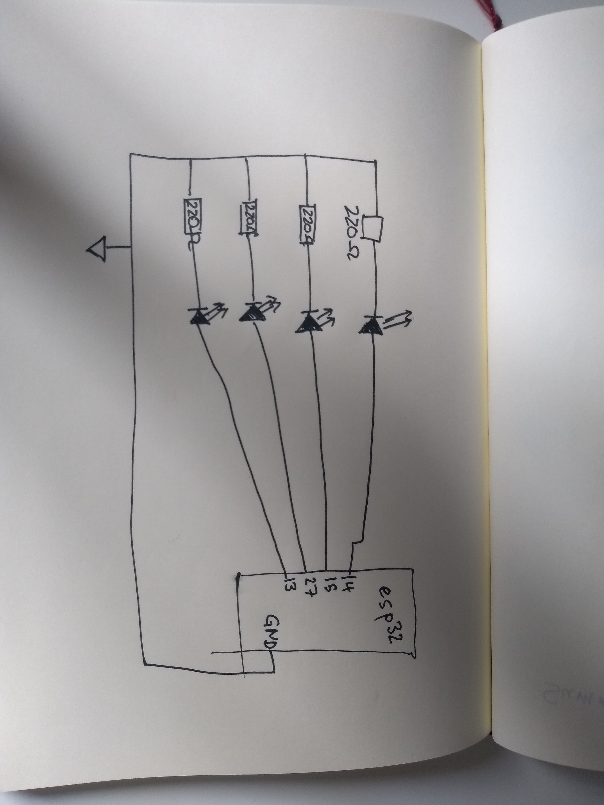
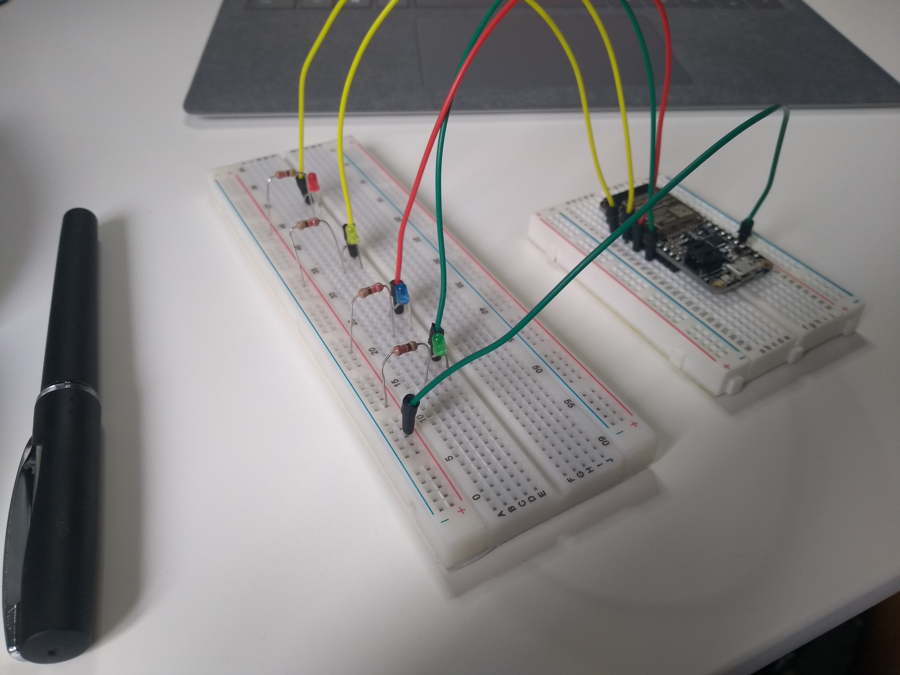

#  Quest 1, Skill 07

Author: Jonathan Cameron

Date: 2020-09-08
-----

## Summary
Counting in binary from 0-15 with LEDs was fairly straight forward. However, I will look into a way of doing it without a switch statement, so that I can set the LEDs to turn on and of at time intervals. I.e, LSB on/off every half second the next LSB on/off every second etc.

I made the counting better, rather than using 16 switch cases, I subtracted the power of two of the bit I was displaying and if it was greater than zero I lit the LED up.

## Sketches and Photos
Here is the link to a youtube video showing it working:

https://youtu.be/aCcERDYeOK0

## Modules, Tools, Source Used Including Attribution
Using the code given in the esp examples on how to make a single LED blink, I adapted it to run 4 LEDs at once:
https://github.com/espressif/esp-idf/tree/master/examples/get-started/blink

## Supporting Artifacts

-----
