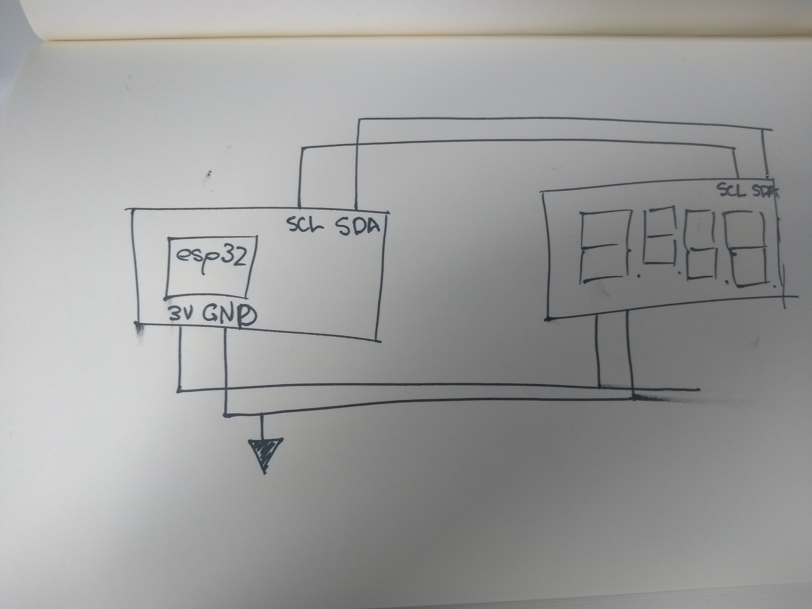
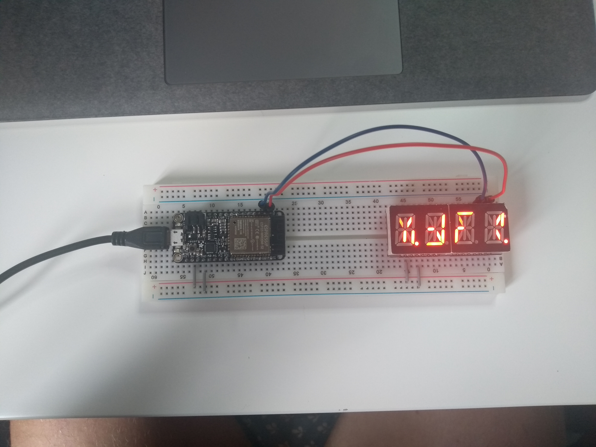

#  Quest 1, Skill 08

Author: Jonathan Cameron

Date: 2020-09-11
-----

## Summary
Alphanumeric display using the code provided on BU-EC444, and the bitmap cheat code which gave the layouts to the different characters

## Sketches and Photos
Here is a Youtube link:

https://youtu.be/hufzrcG_5LU

## Modules, Tools, Source Used Including Attribution
I used the code example from Emily Lam on BU-EC444:
https://github.com/BU-EC444/code-examples/tree/master/i2c-display

and the bitmap cheat given here:
https://github.com/adafruit/Adafruit_LED_Backpack/blob/master/Adafruit_LEDBackpack.cpp

## Supporting Artifacts

-----
