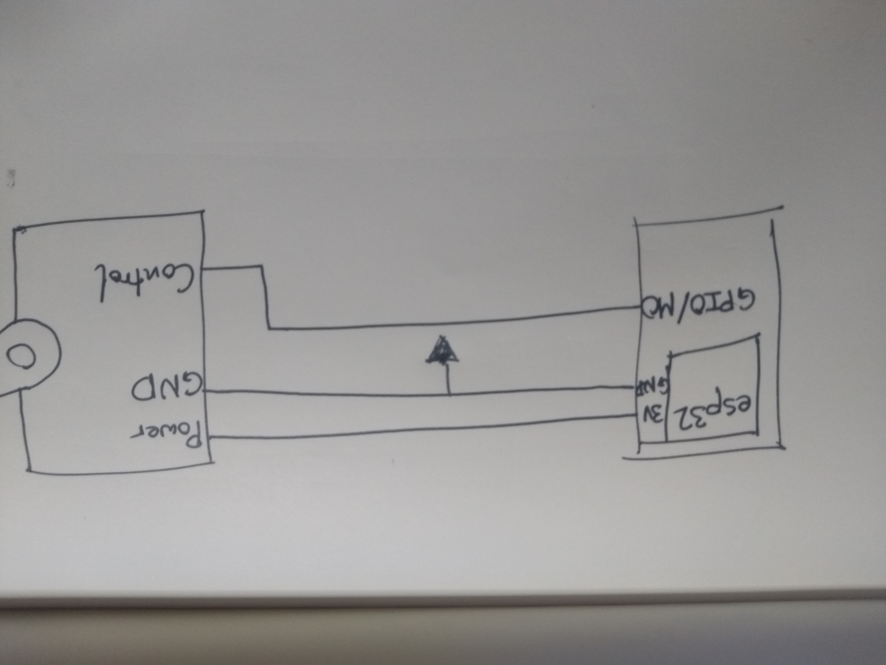
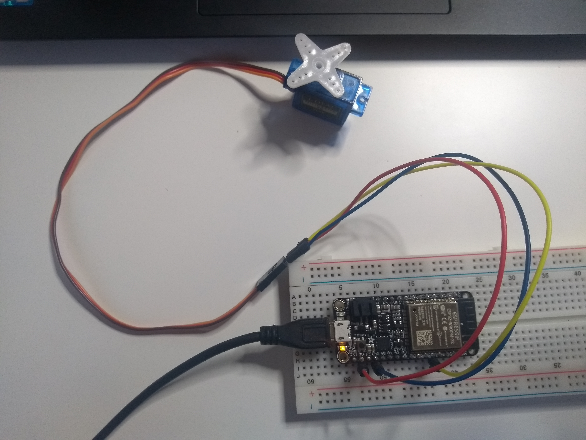

#  Quest 1, Skill 09

Author: Jonathan Cameron

Date: 2020-09-11
-----

## Summary
Using the example code from Espressif, I tweaked the MIN and MAX pulsewidth to get a full 180 degrees of motion. I changed the MIN pulsewidth to 400 and MAX pulsewidth to 2400.

## Sketches and Photos
Here is a video of it working:

https://youtu.be/U9Gz2qKN4Hc

## Modules, Tools, Source Used Including Attribution
I used the example code given by esp:
https://github.com/espressif/esp-idf/tree/master/examples/peripherals/mcpwm/mcpwm_servo_control

## Supporting Artifacts

-----
