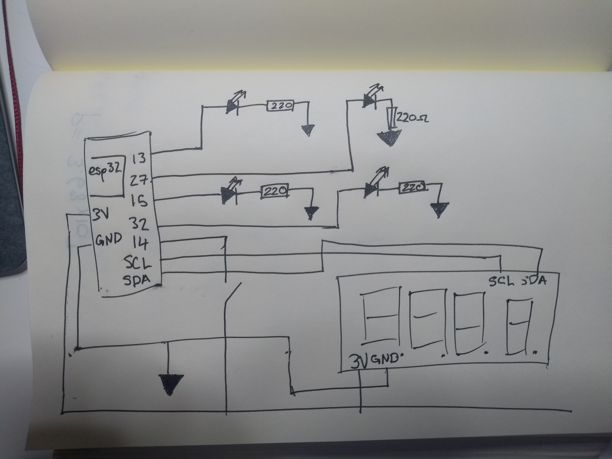
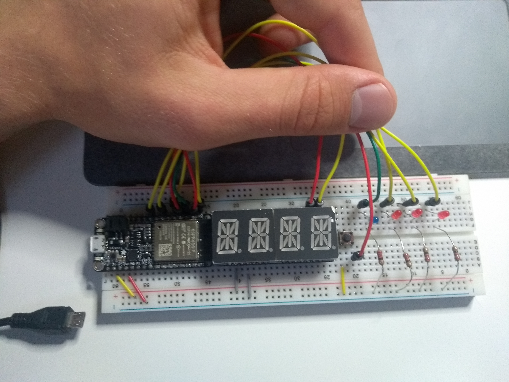

#  Quest 1, Skill 10

Author: Jonathan Cameron

Date: 2020-09-18
-----

## Summary
The combination of the alphanumerical and LED driver was nowhere near as hard as getting the interrupt from the button working.

## Sketches and Photos
Here is a link to a Youtube video:
https://youtu.be/Xw3GKTsz4H8

## Modules, Tools, Source Used Including Attribution
I used the API reference in getting the button interrupt to work.
https://docs.espressif.com/projects/esp-idf/en/latest/esp32/api-reference/system/freertos.html

I used the 14-segment display code used previously in the cluster.

## Supporting Artifacts

-----
