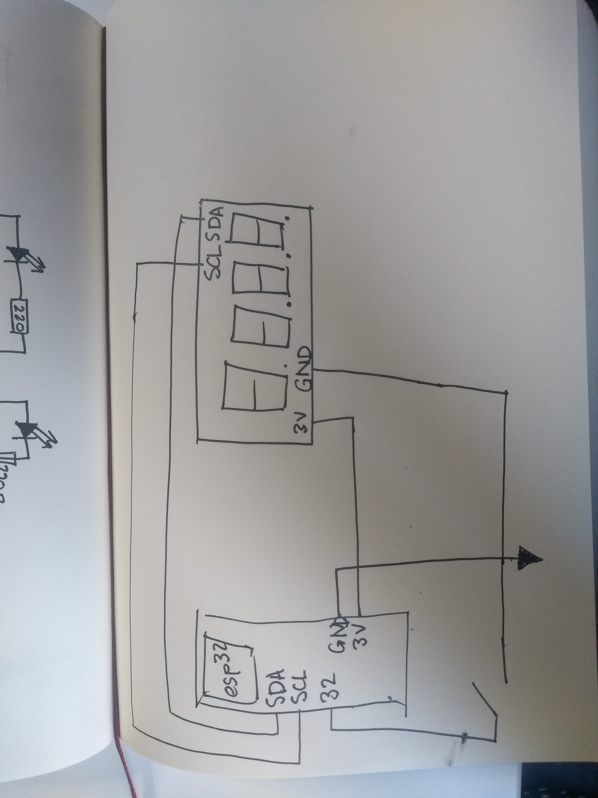
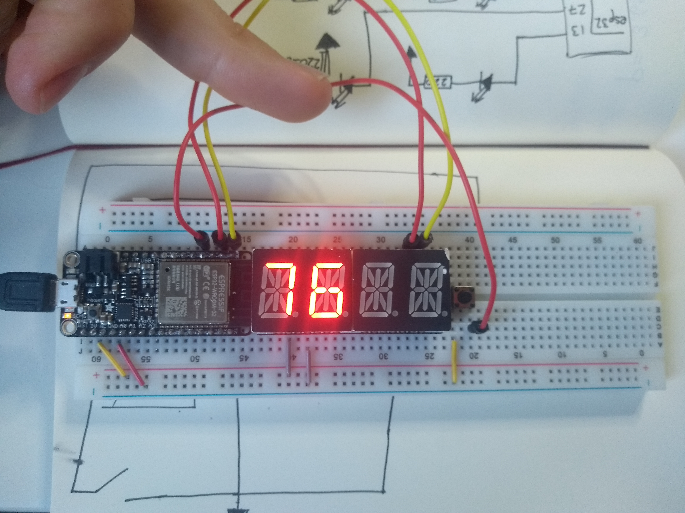

#  Quest 1, Skill 11

Author: Jonathan Cameron

Date: 2020-09-20
-----

## Summary
This skill was to make a stop-clock with a button interrupt and a timer interrupt. The timer would not start until after an initial button press and a button press would restart it from 0. The timer would loop back to 0 at 99 seconds.

## Sketches and Photos
Here is a link to a Youtube video of it doing it's thing:
https://youtu.be/KlBSA4Wg8CA

## Modules, Tools, Source Used Including Attribution
BU-EC444 code-examples, Emily Lam. timer-example.c

14-segment display code from previously used and attributed examples

## Supporting Artifacts

-----
