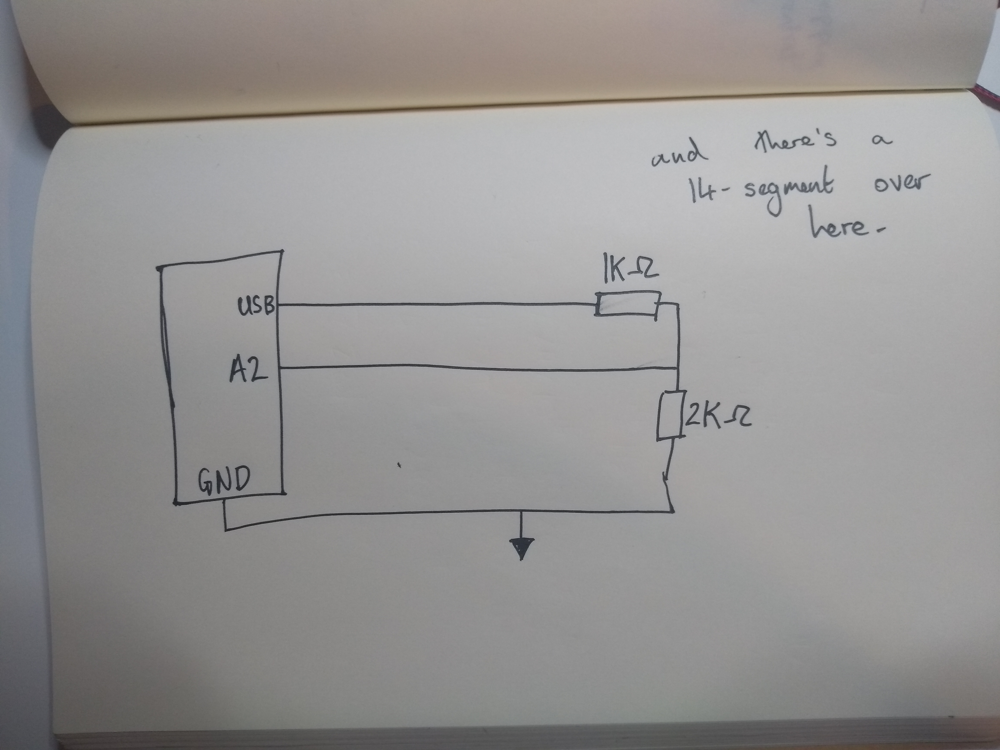
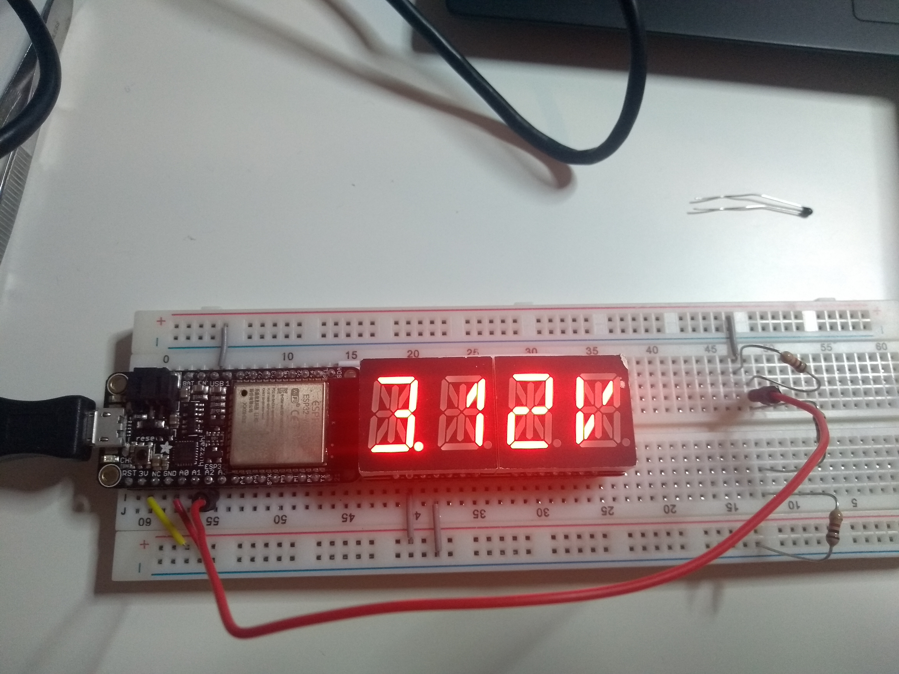

#  Quest 2, Skill 12

Author: Jonathan Cameron

Date: 2020-09-25
-----

## Summary
This skill was to use a voltage divider to give input to an ADC pin and measure the voltage it receives. The voltage divided was the output of the USB pin on the Huzzah32.

## Sketches and Photos

## Modules, Tools, Source Used Including Attribution
For this I used the ADC example from the espressif repo

## Supporting Artifacts
https://github.com/espressif/esp-idf/tree/39f090a4f1dee4e325f8109d880bf3627034d839/examples/peripherals/adc

-----
