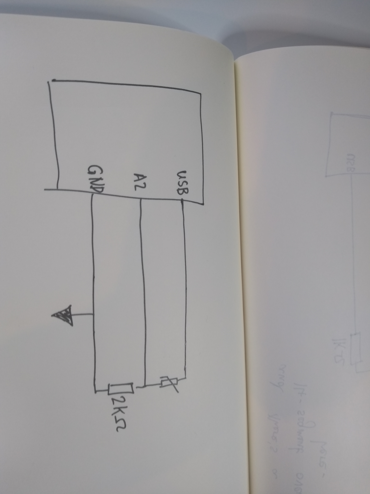
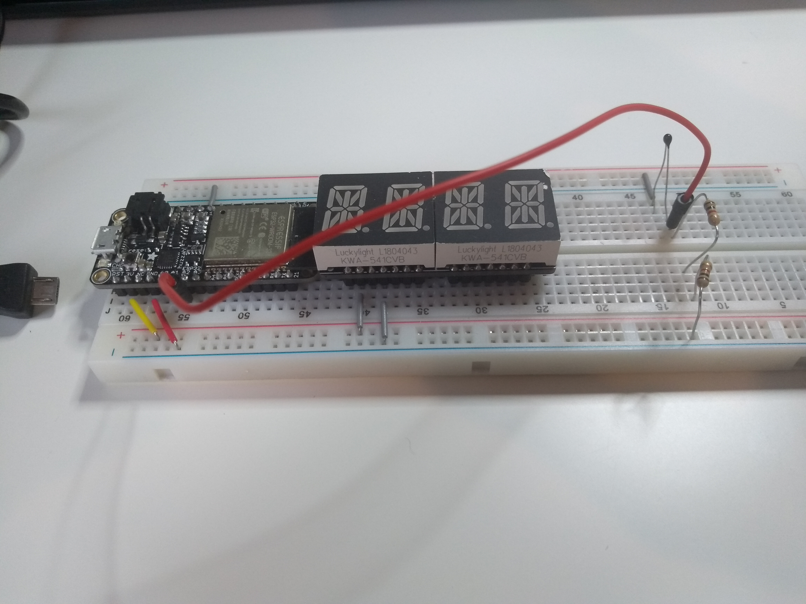

#  Quest 2, Skill 13

Author: Jonathan Cameron

Date: 2020-10-02
-----

## Summary
The goal of this quest was to create a thermometer with a thermistor and a voltage divider.

## Sketches and Photos

## Modules, Tools, Source Used Including Attribution
For this I used the ADC example from the espressif repo

## Supporting Artifacts
https://github.com/espressif/esp-idf/tree/39f090a4f1dee4e325f8109d880bf3627034d839/examples/peripherals/adc

-----
