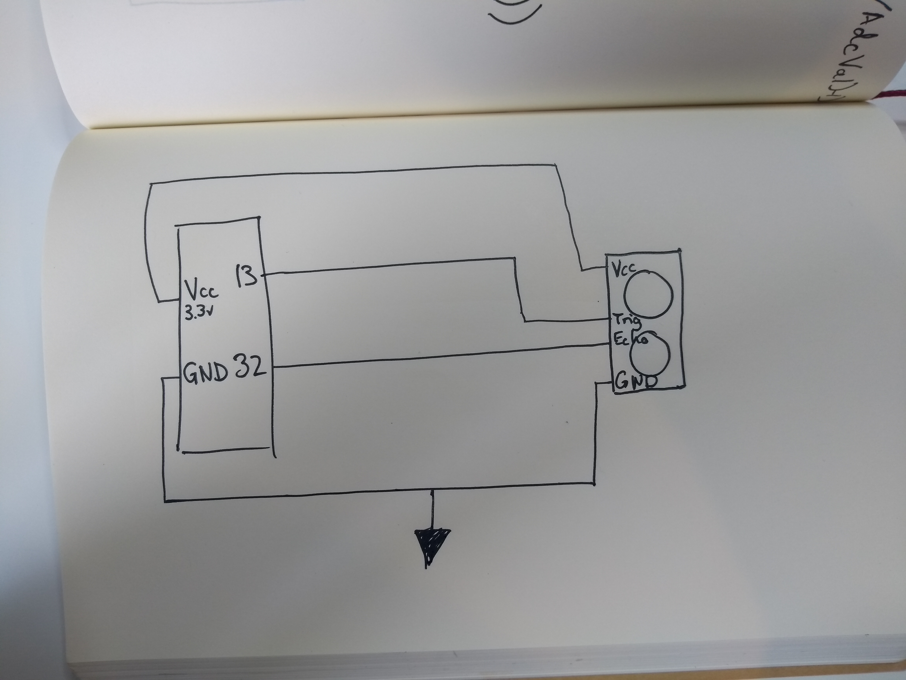
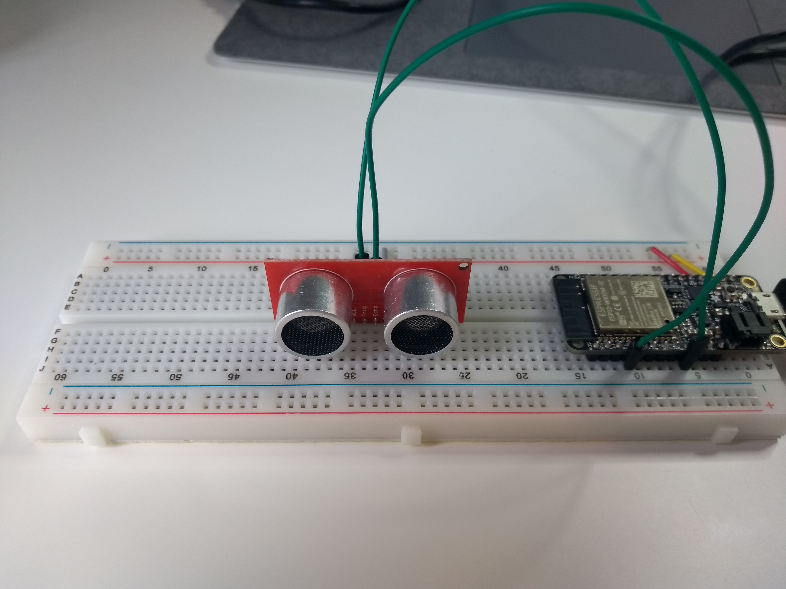
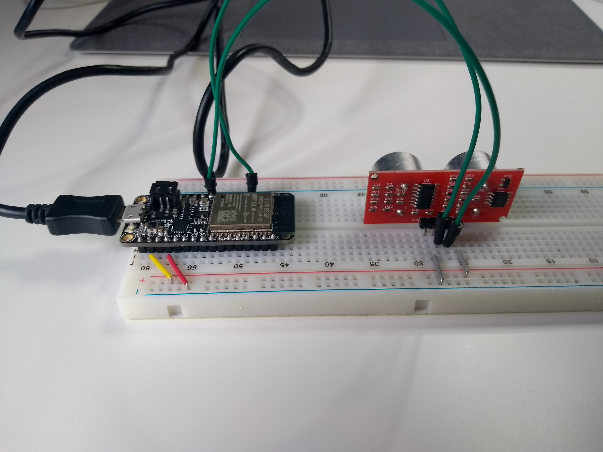

#  Quest 2 Skill 14

Author: Jonathan Cameron

Date: 2020-10-03
-----

## Summary
Skill 14 was to get an ultrasonic sensor measuring distance. Originally I tried to make the cyclops sensor work with ADC, but multiplying the number of bits received by 5, since the documentation stated 5mm/bit. I had limited success with this, experimenting with different attentuation values and trying different voltage inputs, swapping between 3.3v and 5v. 
    As I was unsatisfied with the accuracy and resolution of measurements I moved on to the HC-SR04 sensor. For this I used
gpio_get_level(), calculating the time between TRIGGER and ECHO and using that time to calculate the distance, taking 340m/s for the speed of sound.

## Sketches and Photos

## Modules, Tools, Source Used Including Attribution
I found that Uncle Rus' code a great place to start, using ultrasonic.c , although I edited it heavily to make my sensor work.

## Supporting Artifacts
https://github.com/UncleRus/esp-idf-lib/tree/master/components/ultrasonic

-----
