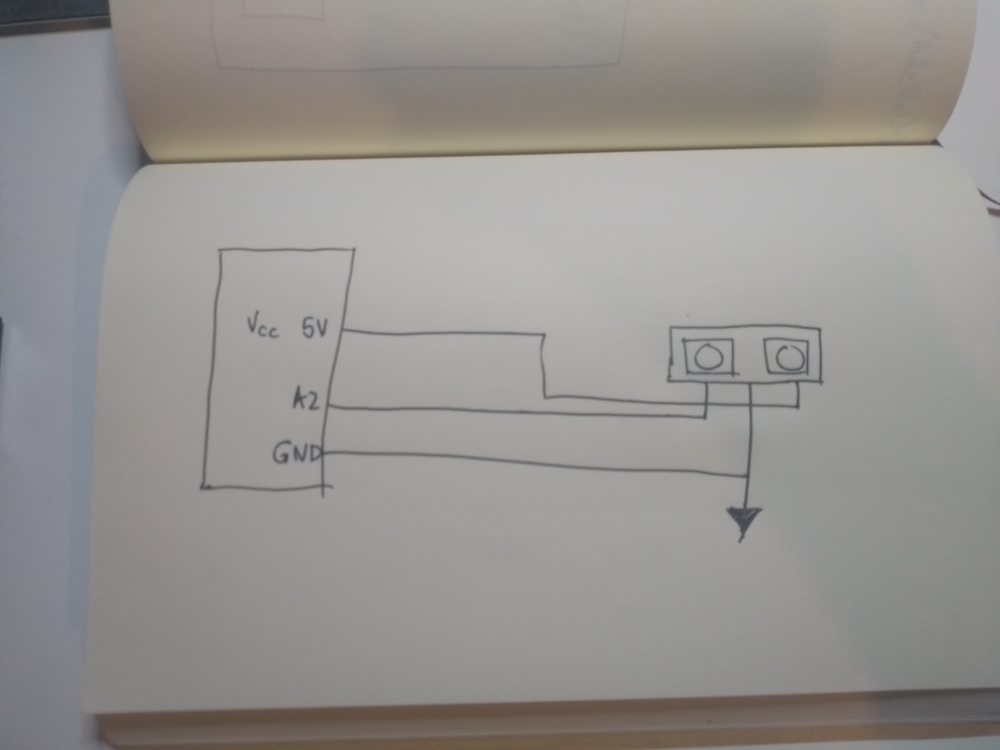
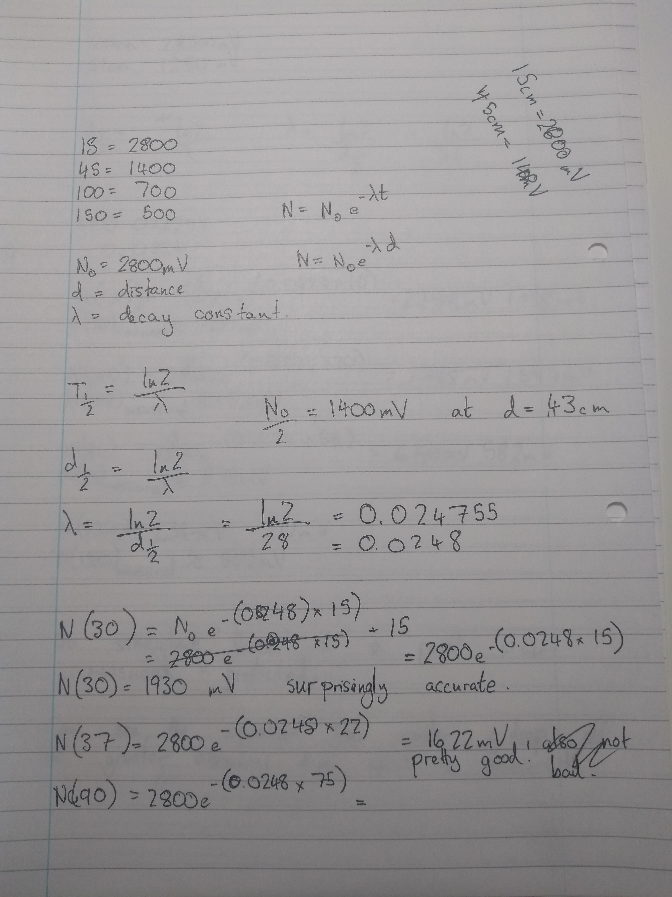
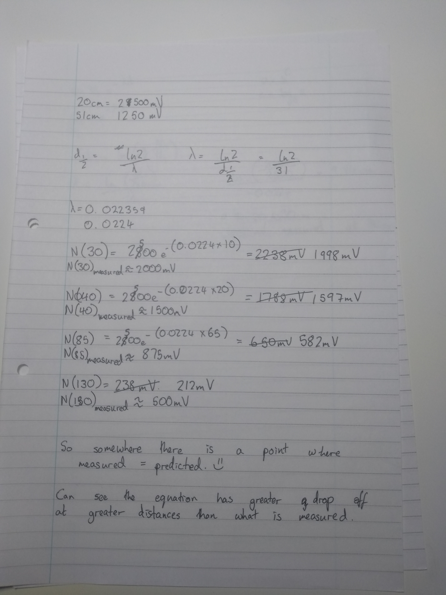
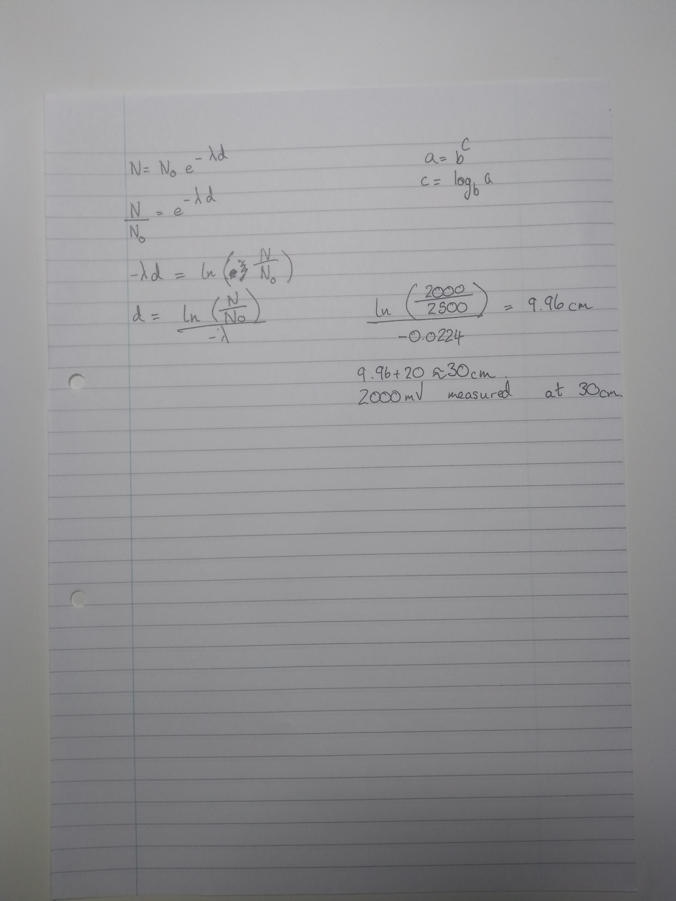

#  Quest 2 Skill 15

Author: Jonathan Cameron

Date: 2020-10-04
-----

## Summary
I had more fun than usual with this quest.
I saw the Voltage/Distance curve and assumed we had to model it as such. I took experimental values for the voltage at certain distances from a wall. Using this data I found the distance at which the voltage was half of what it is at 20cm, which is what the datasheet said was the sensors minimum range.

I used the equation used for calculating decay of a radioactive isotope to figure out the distance.

No = N * e ^ (-lambda * time)

Where lambda = ln(2) / (d/2)

This does have it's limitations. As the distance gets greater, it becomes less accurate measuring distances closer than they appear.

## Sketches and Photos
Here is a link to a youtube video showing it:
https://youtu.be/gG-hpUWHgpg

## Modules, Tools, Source Used Including Attribution
For this I used the ADC example code from espressif to get started, then did the maths on the ADC input voltage.

## Supporting Artifacts

-----
