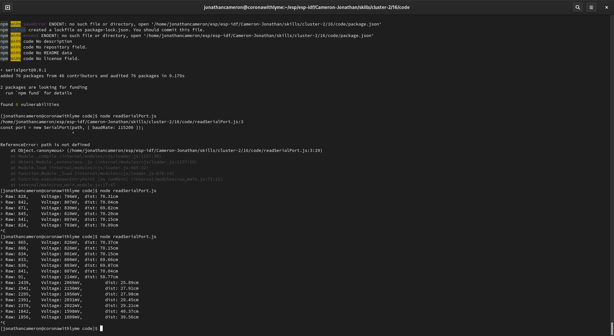
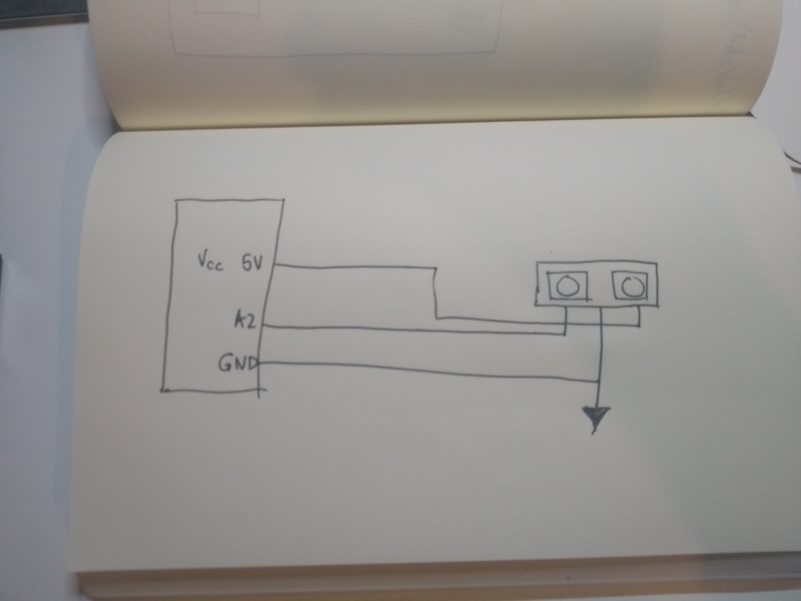
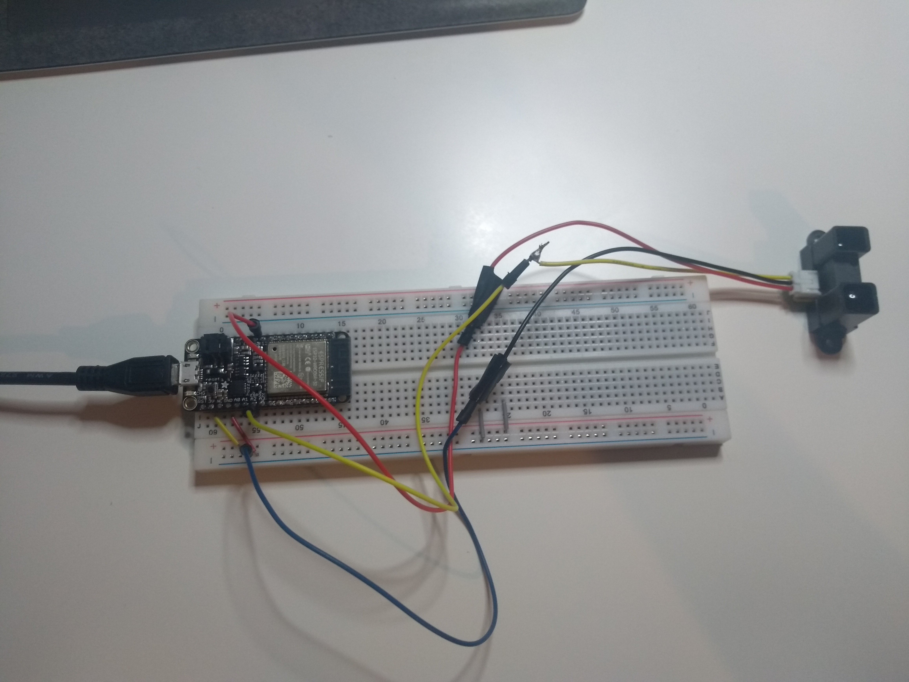

#  Quest 2 Skill 16

Author: Jonathan Cameron

Date: 2020-10-06
-----

## Summary
I used my code from Quest 15 that printed the distance data to the screen when monitored. When I flashed the board without monitoring I used the linux command 'screen /dev/ttyUSB0 115200' to see that the board was sending data over the serial port.

Then I used the example on the serialport.io website to open and read the serial port and print to the command line.

## Sketches and Photos

## Modules, Tools, Source Used Including Attribution
https://serialport.io/

## Supporting Artifacts

-----
