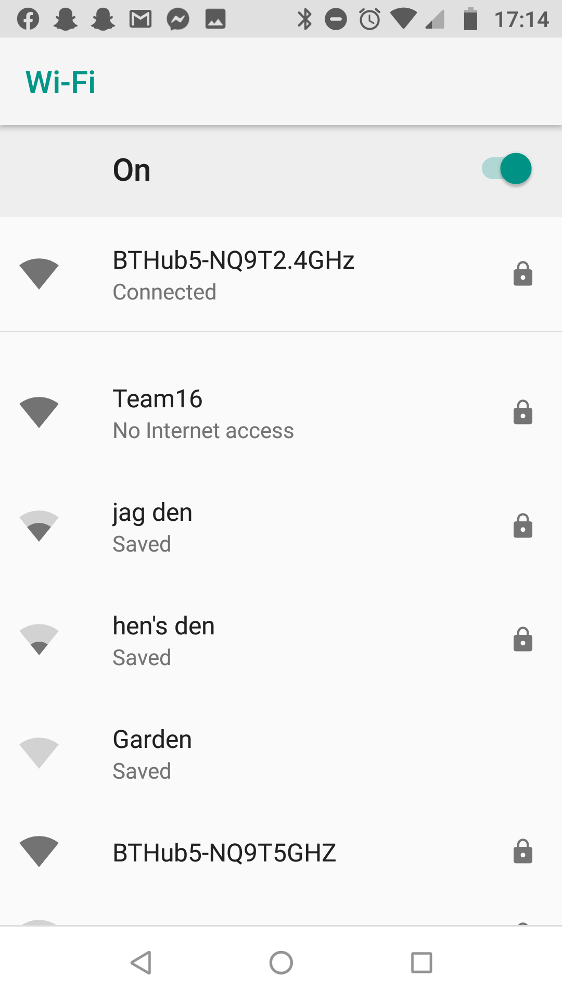
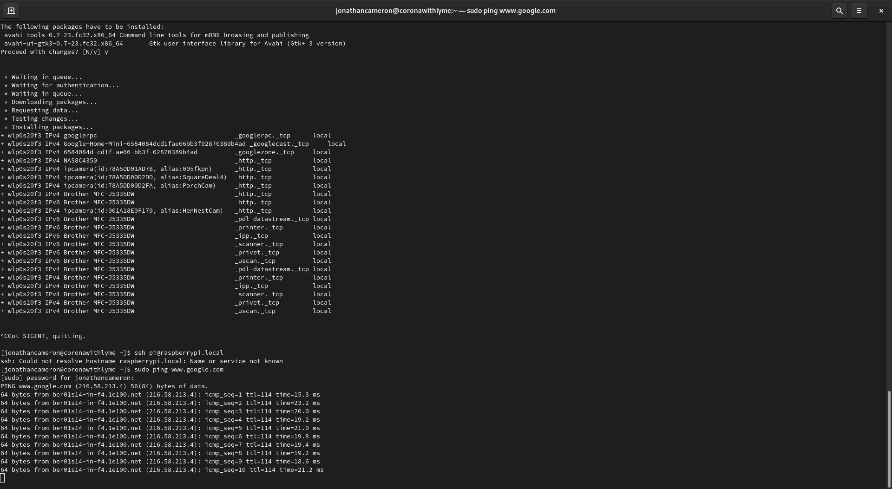

#  Quest 3, Skill 19    

Author: Jonathan Cameron

Date: 2020-10-10
-----

## Summary
This challenge was to set up the Pi Zero W as a WiFi Access Point, so that other devices can connect to it, like an ESP32.
See in the photo, a Team16 option is available to connect to on my phone and to another laptop I have. I also included a screenshot from my laptop pinging www.google.com whilst connected to the RPi router.

## Sketches and Photos

## Modules, Tools, Source Used Including Attribution
For this skill I used the instructions given in the brief.

## Supporting Artifacts

-----
