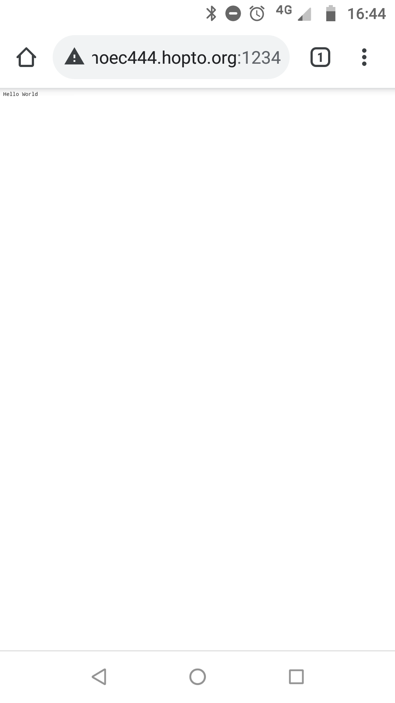
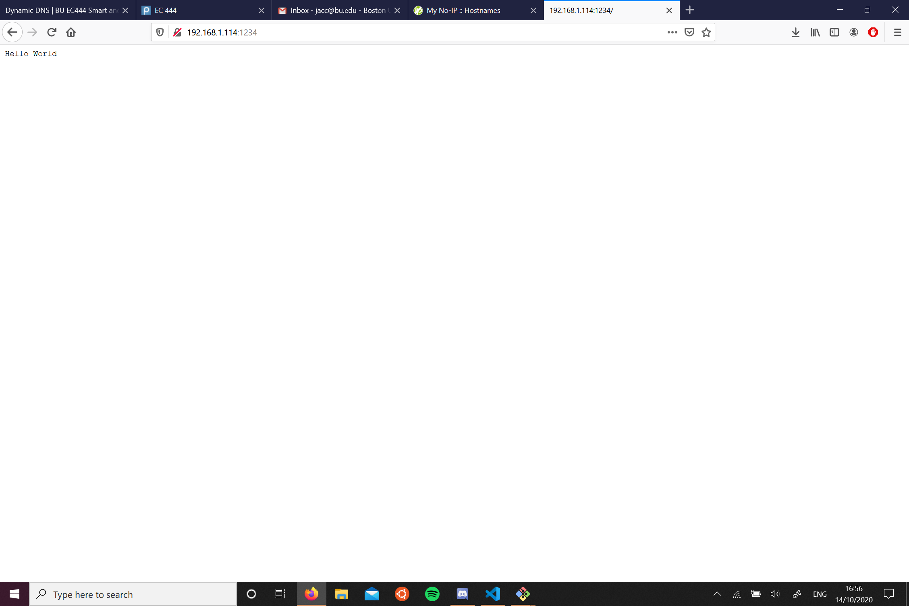

#  Quest 3, Skill 20

Author: Jonathan Cameron

Date: 2020-10-14
-----

## Summary
This challenge was to set up a web server on the RPi, that could be accessed from both inside the local network and from a different network, for example on my phone, which wasn't connected to the local WiFi.

As you can see from the images included, I connected from both my phone running on cellular data and my laptop which was connected to the same network as the RPi.

## Sketches and Photos

## Modules, Tools, Source Used Including Attribution
For this skill I used this guide along with a lot of determination:
https://domoticproject.com/accessing-raspberry-ddns/

## Supporting Artifacts

-----
