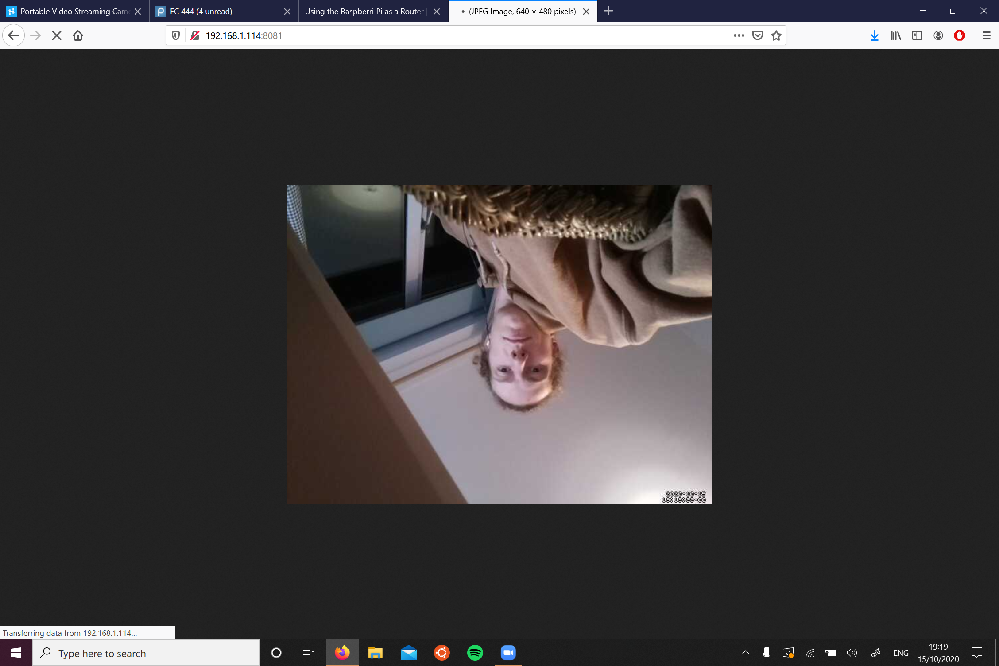
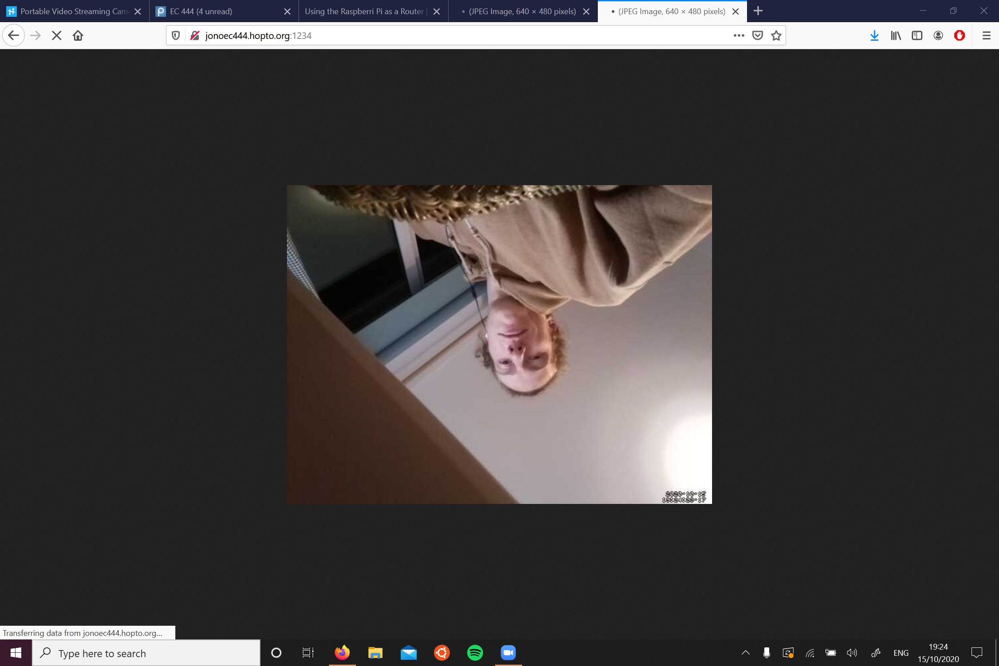
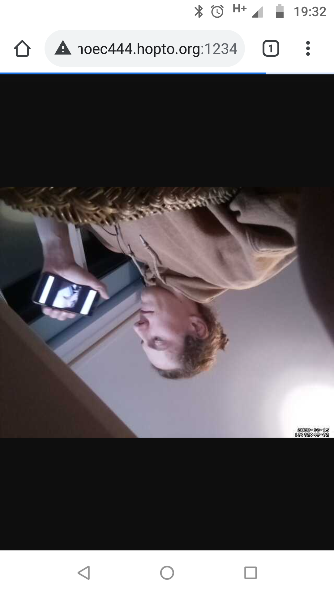

#  Quest 3, Skill 21

Author: Jonathan Cameron

Date: 2020-10-14
-----

## Summary
This challenge was to set up the RPi webcam so that in the future we can have the RPi broacast the camera contents to either the internal internet or on the webserver we made in the last skill. I have included a screenshot of me connecting to it on my laptop through the local IP, then on my laptop connecting through the website I site up in skill 20.

Finally I have a screenshot of my phone which is not connected to WiFi, so is running on cellular data, and is seeing the RPi webserver through the world wide web.

## Sketches and Photos

## Modules, Tools, Source Used Including Attribution
For this skill I used hackster's blog linked in the skill brief:
https://www.hackster.io/narender-singh/portable-video-streaming-camera-with-raspberry-pi-zero-w-dc22fd

## Supporting Artifacts

-----
