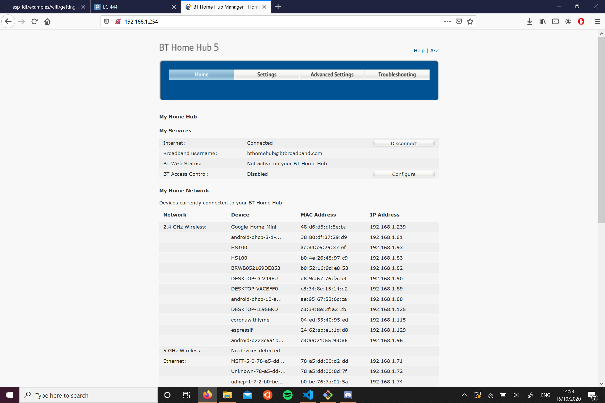
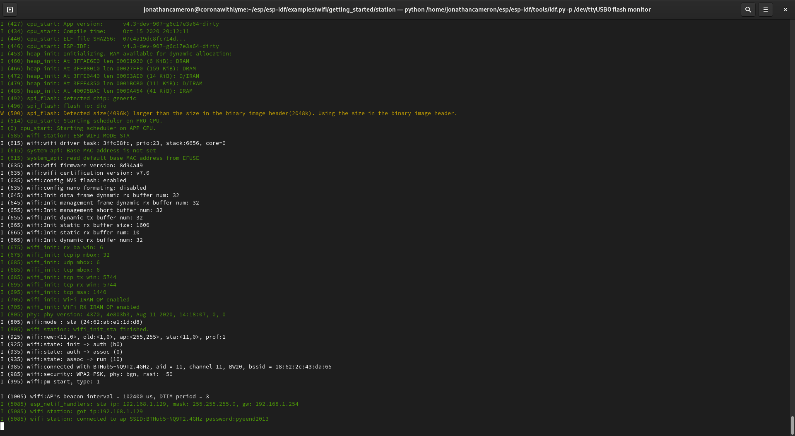

#  Quest 3, Skill 22

Author: Jonathan Cameron

Date: 2020-10-16
-----

## Summary
This challenge was to simply connect the esp32 to the local WiFi network.

The esp32 can be seen as the device"espressif".

## Sketches and Photos

## Modules, Tools, Source Used Including Attribution
For this skill, I used the example code given by espressif:
https://github.com/espressif/esp-idf/tree/master/examples/wifi/getting_started/station

## Supporting Artifacts

-----
