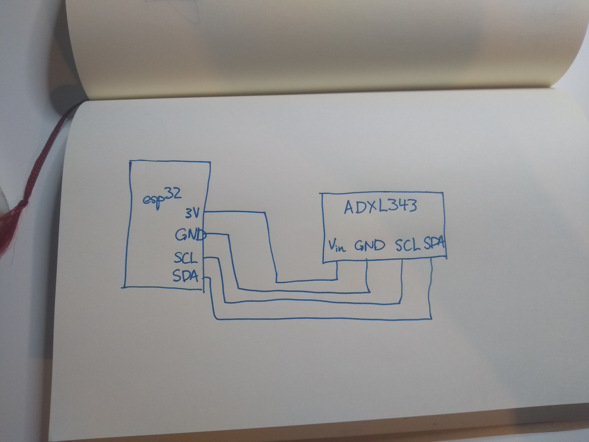

#  Quest 3, Skill 23

Author: Jonathan Cameron

Date: 2020-10-20
-----

## Summary
This skill was to use the ADXL343 accelerometer to read acceleration in the x, y and z direction and to convert these acceleration values to the boards roll and pitch. The device was interfaced with through I2C, which meant reading registers of the accelerometer itself.

## Sketches and Photos
Here is a link to a demonstration on youtube:
https://youtu.be/SbQbSTigwm0

## Modules, Tools, Source Used Including Attribution
For this skill I used the base code provided by the Professor:
https://github.com/BU-EC444/code-examples/tree/master/i2c-accel

I also depended heavily on the data sheet for the ADXL343.

## Supporting Artifacts

-----
