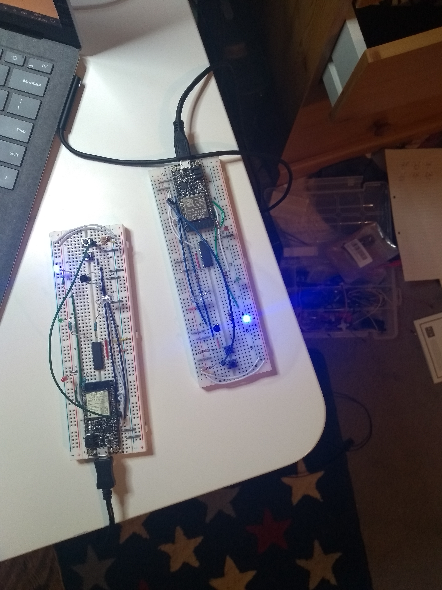

#  Quest 4, Skill 25

Author: Jonathan Cameron

Date: 2020-10-30
-----

## Summary
This challenge was to build two fobs that would send the their state to the other fob: their ID and colour. Then the other fob will copy the colour of the first. This works both ways around, they copy each other.

Upon reading the skill description, I realised that I need two buttons, one to change colour, and one to start transmitting the state of the fob.

The second button was implemented by basically copying everything from the first button but slightly changing what the second button did. It set a "transmit" flag so which starts sending the ID and colour data to the UART buffer to be transmitted. One problem I had to debug was the watchdog getting upset by this process being "skipped" by not having the flag set, so I had to put an else statement to wait for fraction of a second to keep it happy.

I'm also lucky enough to have my own breadboard at home so I could build two "big" fobs and avoid the struggle of using the little breadboard.

## Sketches and Photos

## Modules, Tools, Source Used Including Attribution
For this I used the example code that was given and edited it for the skill.

## Supporting Artifacts

-----
