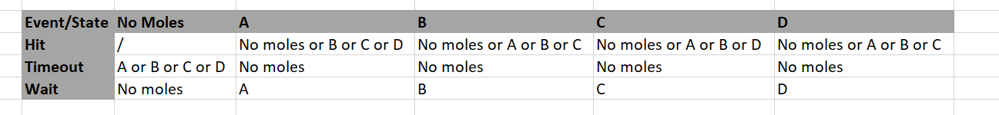

#  Quest 4, Skill 27

Author: Jonathan Cameron

Date: 2020-07-11
-----

## Summary
This skill was to design a finite state machine that plays whack a mole

I decided to implement the FSM with conditionals.

A FSM that plays whack a mole needs a state where there are no moles currently poking their heads up through the ground, and then a number of states where there are moles poking their heads up. I choose to only have one mole poking up at any one time but it could easily be made so that several moles were up at once.

## Sketches and Photos

## Modules, Tools, Source Used Including Attribution
Implementing a FSM:
http://whizzer.bu.edu/briefs/design-patterns/dp-state-machine

## Supporting Artifacts

-----
