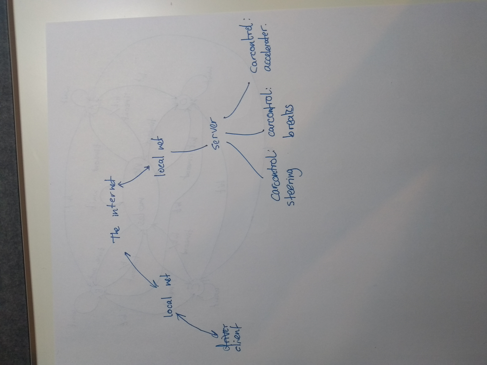

#  Quest 4, Skill 29

Author: Jonathan Cameron

Date: 2020-11-07
-----

## Summary
### Weaknesses in the overall system:
Vulnerable to spoofing, Man in the Middle (MITM) attacks and Denial of Service (DOS) attacks.

### Ways a Bad Guy could attack my system
-There is no encryption between the client and the local net, nor is there encryption between car's local net and the car's server, or encryption between the car's server and the car controllers, data is send as plain text.

-The client is vulnerable to MITM attacks, which would allow an attacker to steal the client's user details which are used to authenticate with the car server.

-The client is vulnerable to spoofing attacks, so the car could be controlled by someone pretending to be the client.

-The car server is vulnerable to DOS attacks, since it'll be listening to a port that is forwarded to it from the car's local net, it would be possible to send lots of data to that port from the outside world to crash the car's server.

-Impersonating the car's server would allow an attacker to steal the credentials of the client, a bit like a MITM attack but doing it on the server side.

## Sketches and Photos

## Modules, Tools, Source Used Including Attribution

## Supporting Artifacts

-----
