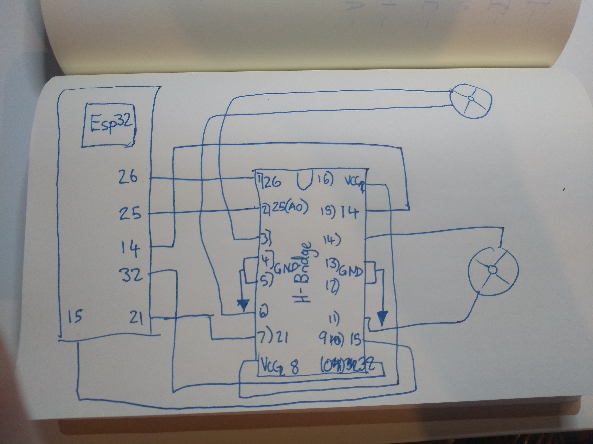
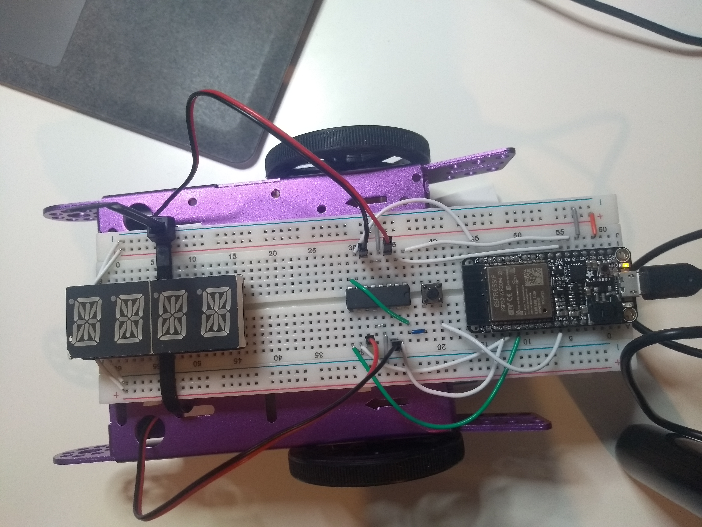
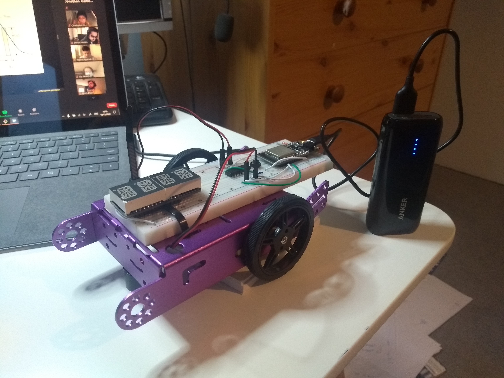

#  Quest 5, Skill 30

Author: Jonathan Cameron

Date: 2020-11-19
-----

## Summary
The requirements for the skill were to construct the purple crawler and get the wheels working. I used the mcpwm_brushed_dc_control as a base. I had to change the enable on the H-bridge so that it is always high, and then control the speed of the wheels by passing it different duty cycles.

I also put a button inbetween the ESP32 5V out and the 5V on the H-bridge because then I could control when the wheels moved and weren't whiring away all of the time.

H1 -> ESP26 Enable 1
H2 -> ESP25 Forwards
H3 -> Wheel (Red)
H4, H5 -> GND
H6 -> Wheel (Black)
H7 -> ESP21 Backwards
H8 -> 5V

H9 -> ESP15 Enable 2
H10 -> ESP32 Forwards
H11 -> Wheel (Red)
H12, H13 -> GND
H14 -> Wheel (Black)
H15 -> ESP14 Backwards
H16 -> 5V

## Sketches and Photos
Here is a video of the, turning:
https://youtu.be/faFVg0JkWKA

## Modules, Tools, Source Used Including Attribution
The base code that I used from espressif:
https://github.com/espressif/esp-idf/tree/master/examples/peripherals/mcpwm/mcpwm_brushed_dc_control

## Supporting Artifacts
The data sheet for the L293D was very useful for making the wheels go forwards and backwards, as it had some clear logic tables
https://cdn-shop.adafruit.com/datasheets/l293d.pdf

-----
