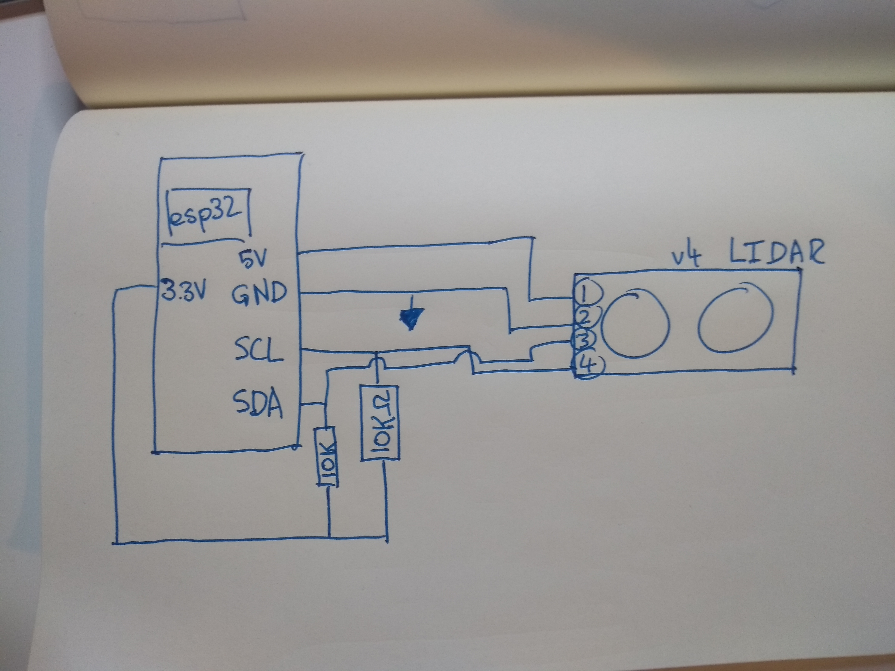
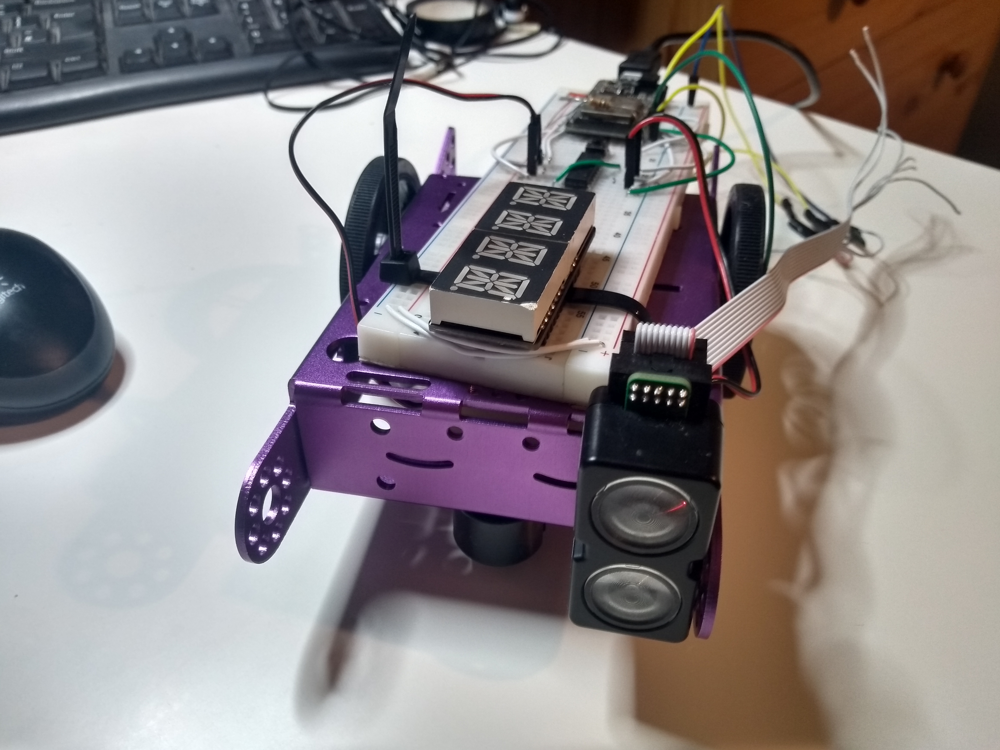
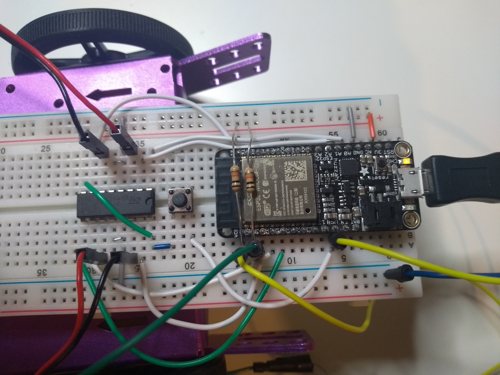

#  Quest 5, Skill 31

Author: Jonathan Cameron

Date: 2020-11-23
-----

## Summary
This skill was to get the Garmin LIDAR-Lite v4 LED up and running using I2C protocol. I used the code from the accelerometer quest to get started and then changed the SLAVE_ADDR to match the LIDAR device.

The LIDAR was wired as follows:
1 -> 5V
3.3V -> 10k Ohm -> SDA
3.3V -> 10k Ohm -> SCL
2 -> GND
3 -> SDA
4 -> SCL

With pull up resistors going to SDA and SCL.

A problem I had with this was interpreting the datasheet and skill brief correctly. I did not realise that the 0x00 register needed to be set to target acquisition (0x04) each time a measurement was needed.

## Sketches and Photos

## Modules, Tools, Source Used Including Attribution
This is the accelerometer base code that I used and adapted, including splitting it up into a .h and .c file so that it can easily be incorporated into the quest.
https://github.com/BU-EC444/code-examples/tree/master/i2c-accel

## Supporting Artifacts
The datasheet for the Garmin LIDAR-Lite v4 LED was very useful for debugging, as initially I found myself reading registers OK but not writing or reading registers properly.
http://static.garmin.com/pumac/LIDAR-Lite%20LED%20v4%20Instructions_EN-US.pdf

-----
