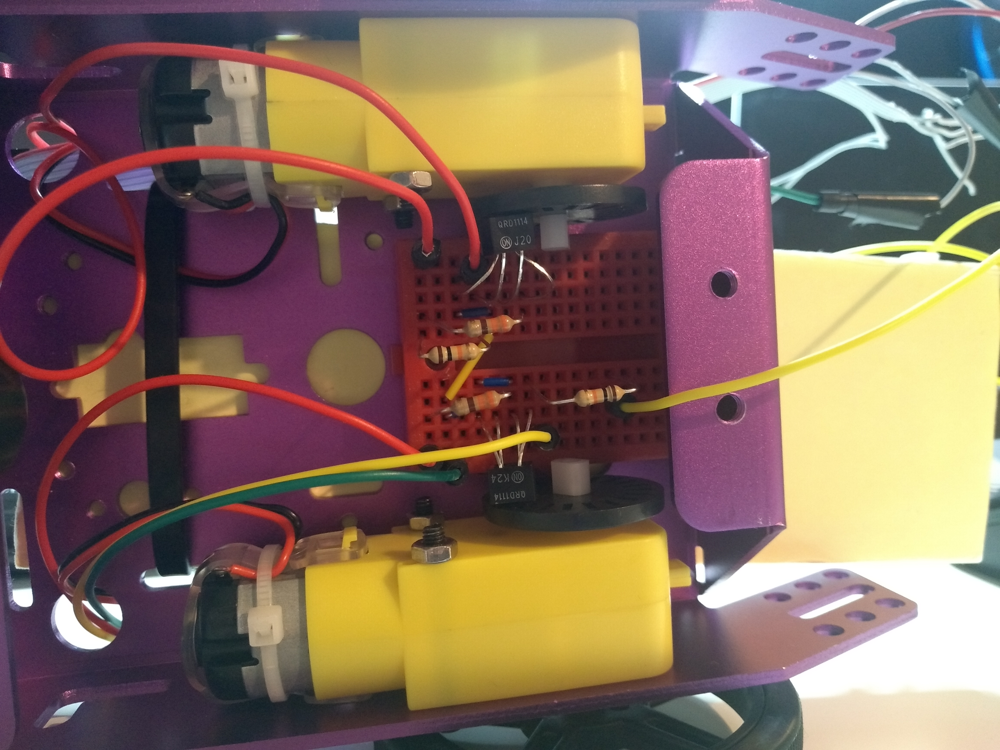
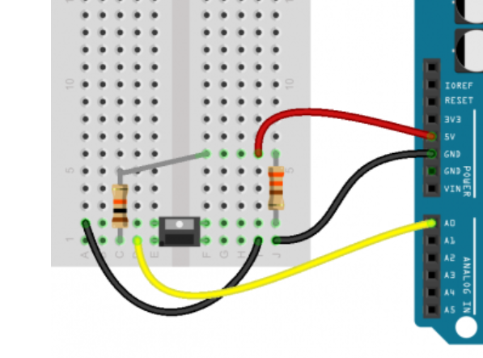

#  Quest 5, skill 32

Author: Jonathan Cameron

Date: 2020-11-27
-----

## Summary
This skill was to use the LED/photo-sensor pair with the holey plate to measure the speed of the wheels.

The right wheel is ADC1 channel 3, the left wheel is ADC1 channel 6. This is important to remember, because the ADC2 mode will not run when the WiFi driver is running, (bug or feature?) and so when we want to start or stop our car with the internet, we will not be able to use ADC2, and must use different channels within ADC1.

I decided to increment a counter for each independent wheel each time the voltage was measured to go over 2800mV, once. For clarity, this means there is a flag set when the reading is over 2800mV, and this will increment the counter once, and will not increment it again until the voltage is measured under the threshold, the flag reset, and then goes back over. I decided to sample the ADC 100 times per second to increase the accuracy of the speed.

Left sensor     -> GPIO34, A2
Right sensor    -> GPIO39, A3

## Sketches and Photos

## Modules, Tools, Source Used Including Attribution
For this is used the base code for the thermistor to get the ADC working:
https://github.com/espressif/esp-idf/tree/master/examples/peripherals/adc

## Supporting Artifacts

-----
