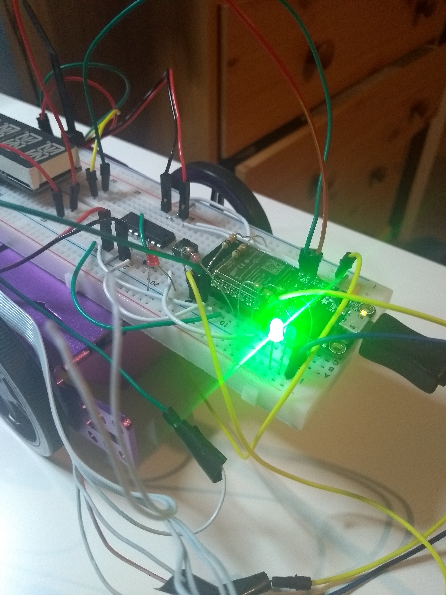
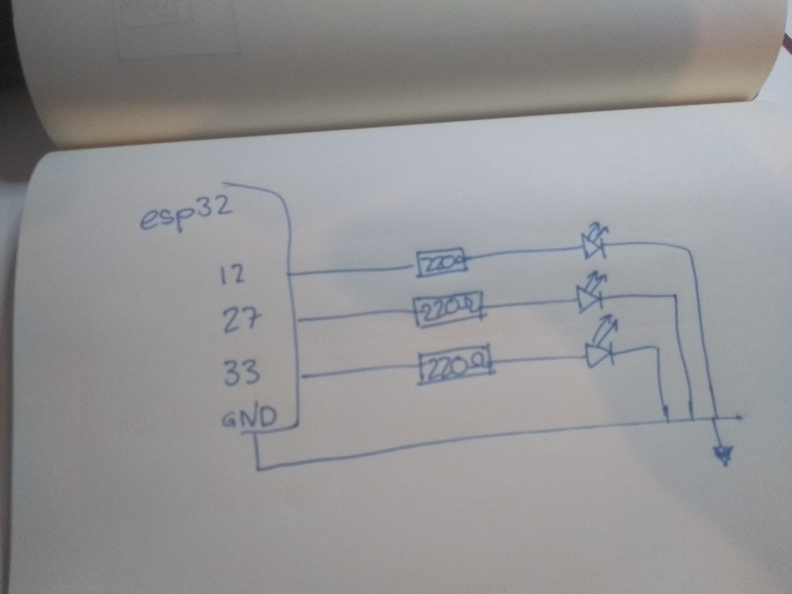

#  Cluster 5, Skill 33

Author: Jonathan Cameron

Date: 2020-11-28
-----

## Summary
This skill required hooking up an interrupt timer, that I got from the ir-traffic-light example, to take distance readings each time it made an interrupt and to calculate the distance change in the time between interrupts. The distance measurements were made by reading from the LIDAR, which I got running in skill 31.

## Sketches and Photos
A link to a small youtube video.
https://youtu.be/WNx6J2VG2oU

## Modules, Tools, Source Used Including Attribution
The ir-traffic-light for the timer:
https://github.com/BU-EC444/code-examples/blob/master/traffic-light-ir-example/main/ir-car-beacon.c

## Supporting Artifacts

-----
