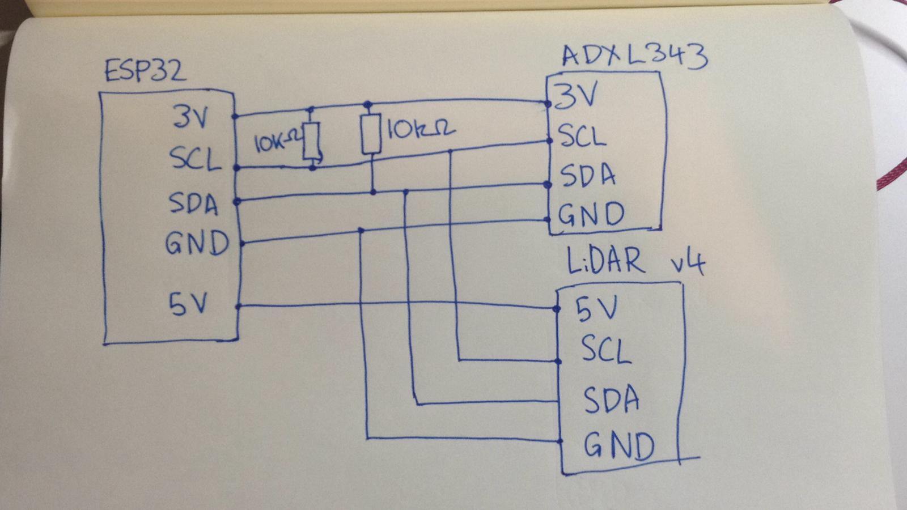

#  Cluster 6, Skill 34

Author: Jonathan Cameron

Date: 2020-12-03
-----

## Summary
This skill is figuring out how to run multiple i2c devices on the same bus.

## Sketches and Photos

## Modules, Tools, Source Used Including Attribution
I used the code from the LiDAR and ADXL343 accelerometer which was supplied in the EC444 code-examples  

## Supporting Artifacts

-----
