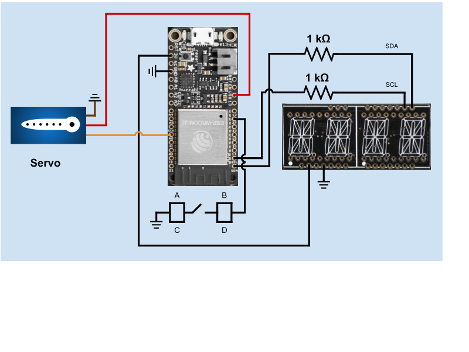

# Quest 1: Fish Feeder
Authors: Jonathan Cameron, DJ Morel, Ryan Sullivan

Date: 2020-09-21
-----

## Summary
In this quest, we connected a servo, I2C display, and button to the ESP32 in 
order to design a fish feeder. The I2C display shows the countdown timer until 
the next feeding. Our i2c_display library enables us to either display the 
remaining time in hours & minutes, or in minutes & seconds. When the countdown 
timer reaches 0, the ESP32 activates the servo to release the fish food from 
the attached canister by rotating from right to left 3 times in a "shaking" 
fashion. The fish feeder system is activated by the press of the push button, 
which sets the countdown timer to the `TIMER_MAX_COUNT` value (specified in 
main.c) and begins counting down every second. If the push button is pressed 
again, the system is turned off and the displayed countdown timer resets to 0.  

## Self-Assessment

### Objective Criteria

| Objective Criterion | Rating | Max Value  | 
|---------------------------------------------|:-----------:|:---------:|
| Servo spins right then left three times without chatter at prescribed time intervals | 1 |  1     | 
| Alphanumeric display indicates hours and minutes | 1 |  1     | 
| Display shows countdown time report every second with no time loss | 1 |  1     | 
| Food dispensed at specific times | 1 |  1     | 
| Demo delivered at scheduled time and report submitted in team folder with all required components | 1 |  1     | 
| N/A | N/A |  N/A     | 
| Investigative question response | 1 |  1     | 

### Qualitative Criteria

| Qualitative Criterion | Rating | Max Value  | 
|---------------------------------------------|:-----------:|:---------:|
| Quality of solution | 5 |  5     | 
| Quality of report.md including use of graphics | 3 |  3     | 
| Quality of code reporting | 3 |  3     | 
| Quality of video presentation | 3 |  3     | 

## Solution Design
Our system uses multiple pins to connect the ESP32 with its hardware modules. The 
exact pins used are listed below (as labeled on the Huzzah32 board):  

* 3V --> 3.3 V input to the I2C display.  
* GND --> Ground to the I2C display and its pullup resistors, servo, and push button.  
* M0 --> Control output signal to the servo.  
* USB --> 5 V input to the servo.
* 27 --> Input signal from the push button.  
* SCL --> SCL connection to I2C display.  
* SDA --> SDA connection to the I2C display.  

The fish feeder can display the countdown time in either hours & minutes or in 
minutes & seconds. For the offical fish feeder system, we use the hour & 
minutes option by configuring main.c's i2c_display_count() function to use 
displayCount_HoursMinutes() and setting `TIMER_MAX_COUNT` to 43200 seconds 
(12 hour countdown). For short proof-of-concept demos, we use the minutes & 
seconds option by configuring main.c's i2c_display_count() function to use 
displayCount_MinutesSeconds() and setting `TIMER_MAX_COUNT` to 83 seconds (1 
minute and 23 seconds countdown).  

## Investigative Question
### What approach can you use to make setting the time interval dynamic (not hard coded)?
A plan of attack to make the time interval dynamic, while still retaining the current circuit, 
could be to measure the length of each button press, possibly by utilizing a modified debouncer. 
Using this a longer button press could move the ESP32 into a "Set Mode" state, where each button press
would first change mode from hours : minutes to minutes : seconds, then after a measured wait, if no button
press had been registered, the board could transition into a "Set Time" state. In this state, the board
would increment the time, as shown on the I2C Display, first the larger period (hours/minutes) then, after
a pause, the smaller period (minutes/seconds). A final pause would set the time interval and then 
any subsequent press would begin the timer and the Fish Feeder would function as required in
this quest.

## Sketches and Photos
**Figure 1**: Fish Feeder Circuit Diagram  
  

## Supporting Artifacts
- [GitHub repo for our solution](https://github.com/BU-EC444/Team16-Cameron-Morel-Sullivan/tree/master/quest-1)
- 

## References (modules, tools, and sources used with attribution)
- Code Template : [esp-idf-template](https://github.com/espressif/esp-idf-template)
- Timer Interrupt Template: [EC444 Timer Framework](https://github.com/BU-EC444/code-examples/tree/master/timer-example)
- I2C Control Template: [I2C Display Framework](https://github.com/BU-EC444/code-examples/tree/master/i2c-display)
- Servo Control Template: [Servo Control Framework](https://github.com/espressif/esp-idf/tree/master/examples/peripherals/mcpwm/mcpwm_servo_control)

-----

