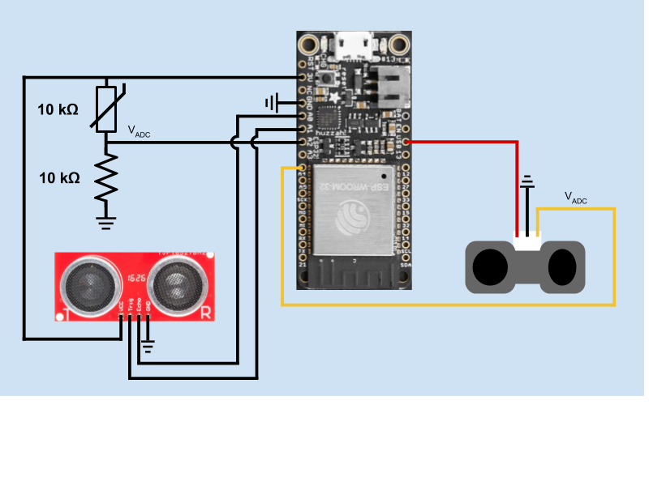

# Quest 2: Tactile Internet
Authors: Jonathan Cameron, DJ Morel, Ryan Sullivan

Date: 2020-10-08
-----

## Summary
In this quest, we combined the sensors we've used in the skills for this unit: 
thermistor, ultrasonic range finder, and infrared (IR) range finder. These 
sensors are sampled every 2 seconds and then their values are written over a 
UART communication. A host device is directly connected to the three sensors 
and reads the values over UART. That host device then uses a Node.js module to 
write those values to a CSV file (`sensor_data.csv`) to be later read by an 
HTML file (`sensor_data.html`) that makes a GET request to the host device to 
parse the data, and display the results in a graph using CanvasJS. Note that 
the data is only plotted when a client requests the HTML file in their browser 
from the host's server Node.js module (separate from the UART reading file). 
Since the UART reading and server Node.js modules are separate, the host can 
call them separately to simultaneously write data to a CSV file and then 
display the results to the client in real-time. It should be noted that the 
current project design resets the contents of the CSV file every minute, so 
that the file does not grow too large.  

Note that we were able to get our solution to run by having a laptop as the 
host and client, and by setting the Raspberry Pi as the host and laptop solely 
as the client. The current master branch is configured for the former setup 
whereas the Morel branch is configured for the latter setup at the moment. 
Keep in mind that for the Raspberry Pi to run as the host, or any device for 
that matter, must have installed Node.js as well as the serialport NPM 
package. Switching between hosts is done by first setting the correct USB port 
for the host device to read UART in `UART_Read_Module.js` as this module is 
responsible for collecting sensor data in real time into a CSV file. 
Additionally, the URL for the sensor data CSV file GET request must also be 
modified in `sensor_data.html` to match the IP address and port number the 
client enters in their browser.  

## Self-Assessment

### Objective Criteria

| Objective Criterion | Rating | Max Value  | 
|---------------------------------------------|:-----------:|:---------:|
| Periodic reporting of ultrasonic range in m | 1 |  1     | 
| Periodic reporting of IR range in m | 1 |  1     | 
| Periodic reporting of temperature in C | 1 |  1     | 
| Results displayed at host as text | 1 |  1     | 
| Results graphed at host continuously based on reporting period | 1 |  1     | 
| Demo delivered at scheduled time and report submitted in team folder with all required components | 1 |  1     | 
| Investigative question response | 1 |  1     | 

### Qualitative Criteria

| Qualitative Criterion | Rating | Max Value  | 
|---------------------------------------------|:-----------:|:---------:|
| Quality of solution | 5 |  5     | 
| Quality of report.md including use of graphics | 3 |  3     | 
| Quality of code reporting | 3 |  3     | 
| Quality of video presentation | 3 |  3     | 

## Solution Design
Our system uses multiple pins to connect the ESP32 with all of its sensors. 
The exact pins used are listed below (as labeled on the Huzzah32 board):  

* 3V --> 3.3 V input to thermistor and ultrasonic sensors.  
* USB --> 5 V input to the IR sensor.  
* GND --> Ground to the thermistor's voltage divider, ultrasonic sensor, and IR sensor.  
* A0 --> Input signal from the ultrasonic sensor's Echo pin.  
* A1 --> Output signal to the ultrasonic sensor's Trigger pin.  
* A2 --> ADC voltage pin from the thermistor's voltage divider.  
* A4 --> ADC voltage pin from the IR sensor.  

It should be noted that our solution uses the Sparkfun ultrasonic sensor over 
the Maxbotix ultrasonic sensor. The reason for this is because some of our 
team members had difficulty getting a non-zero reading from the Maxbotix 
sensor when using the ADC implementation for data collection.  

According to the datasheets for our ultrasonic and IR sensors, they have an 
operating range of 2cm-400cm and 20cm-150cm, respectively. Typical operating 
ranges for our thermistors tend to go from -55C to +150C.  

By default, our sensors measure temperature in Kelvin and distance in 
centimeters. We selected these units of measurements because we wanted to 
ensure all data sent over UART was positive (made temperature conversions 
easier) and we wanted to use the unit range specified by our range finder 
sensors. However, those values are converted to Celcius and meters for our 
data graphs in order to meet the specifications for this quest.  

All sensor data over UART is grouped together and formatted a certain way for 
every 2 seconds of sensor sampling. The following shows the general format of 
the data:

`<Global count variable>,T,<temperature in K>,I,<IR distance in cm>,U,<Ultrasonic distance in cm>\n`  

Note that the global count variable is merely an unsigned integer from 0 to 90 
that is used to track data lines with respect to each other. Each of the 
sensor data is recorded as a double from the thousands place to the 
hundredths place (####.##). The newline character is used to parse different 
lines of UART data from one another, and each line is parsed by sensor 
component into a CSV file. As mentioned earlier, that CSV still keeps units in 
Kelvin and centimeters, and is only converted to the quest specified units 
when the CSV contents are parsed for CanvasJS plotting. The global count 
variable is used as the time axis (x-axis) for the 3 sensor graphs that 
connects all of the sensor data with respect to time. Recall that the sensors 
are sampled every 2 seconds and each sampling increments the global count. 
This means that the global count should be multiplied by 2 to get the total 
elapsed time in seconds since the sampling started or since the most recent 
count reset. In other words, the global count only gives the relative time 
between sensor data and not the overall time in a date format.  

One thing that we noticed when measuring data from the ultrasonic and IR 
sensors is how they appear to "jump" at times. This happens if the measured 
target's surface is not perfectly perpendicular to the sensor. Recall that the 
range finders rely on sending a signal from their transmitter and then getting 
the signal back at their receiver. If the target object is angled, the signal 
may bounce off the surface of the object at an undesirable angle and miss 
returning to the sensor's receiver. This situation is especially noticable the 
farther away the target object is from the sensor. Small changes in angles 
change the trajectory of a returning signal the farther the target.  

## Investigative Question  
### Tabulate and compare the accuracy and speed of the IR and ultrasonic sensors. Which one would you prefer to use to support driving a robotic car?  
Both the IR and ultrasonic sensors are used to measure the range/distance of 
an object from the sensor. Additionally, both objects use a same method of 
measuring distance that being sending an output signal from a transmitter, 
have the signal bounce off the target, and then have the signal return to the 
sensor's receiver as an input. From our results, we saw that the ultrasonic 
sensor tends to be more accurate when measuring distance.  

Additionally, the Sparkfun ultrasonic sensor's datasheet shows that it has a 
larger supported range of measurement (2cm to 400cm) compared to the IR 
sensor (20cm - 150cm). Just looking at range alone, the ultrasonic sensor 
seems to be the better pick for a robotic car. If a car were to avoid a 
collision, it would need to know the distance of objects as far away from it 
as possible in order to give it enough time to stop. This is especially 
important for higher speeds the car travels, since more time is needed for the 
car to brake.  

One more reason why the ultrasonic sensor is better deals with how the IR sensor 
operates. Recall that IR sensors detect IR waves, hence their name. However, the 
sun also releases IR waves which can reduce an IR sensor's accuracy. Since a 
robotic car is very likely to drive outside, sunlight may adversely affect the 
IR sensor's readings. As a result, the ultrasonic sensor is the better choice 
between the two.  

## Sketches and Photos
**Figure 1**: Tactile Internet Circuit Diagram  
  

## Supporting Artifacts
- [GitHub repo for our solution](https://github.com/BU-EC444/Team16-Cameron-Morel-Sullivan/tree/master/quest-2)  
- [Link to video demo](https://www.youtube.com/watch?v=1Sqv2cAWsEU). Not to exceed 120s  

## References (modules, tools, and sources used with attribution)  
- [esp-idf-template](https://github.com/espressif/esp-idf-template)  
- [EC444 Timer Framework](https://github.com/BU-EC444/code-examples/tree/master/timer-example)  
- [Sparkfun Ultrasonic Range Finder Datasheet](https://cdn.sparkfun.com/assets/b/3/0/b/a/DGCH-RED_datasheet.pdf)  
- [Maxbotix IR Range Finder Datasheet](https://www.sparkfun.com/datasheets/Sensors/Infrared/gp2y0a02yk_e.pdf)   
- [esp-idf-lib Ultrasonic Component](https://github.com/UncleRus/esp-idf-lib/tree/master/components/ultrasonic)  
- [Node.js Installation](https://nodejs.org/en/)  
- [W3Schools Node.js Tutorials](https://www.w3schools.com/nodejs/default.asp)  
- [Node SerialPort Documentation](https://serialport.io/docs/guide-about)  
- [CanvasJS](https://canvasjs.com/)  
- [Ultrasonic vs Infrared (IR) Sensors](https://www.maxbotix.com/articles/ultrasonic-or-infrared-sensors.htm)  

-----

