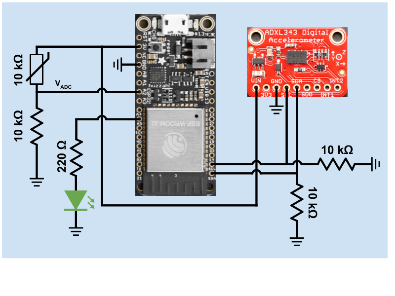

# Quest 3: Hurricane Box
Authors: Jonathan Cameron, DJ Morel, Ryan Sullivan

Date: 2020-10-23
-----

## Summary
In this quest, we designed a Hurricane Box that measures temperature through a 
thermistor and vibration through an accelerometer. That sensor data is 
displayed in CanvasJS graphs on a web portal that a client can access 
remotely. That web portal is hosted by a Raspberry Pi and displays a camera 
livestream from a different port number, but is able to be displayed on the 
same page through the use of an image tag (gives better performance than an 
iFrame). Additionally, the web portal includes a slider that adjusts the ESP's 
LED PWM intensity remotely.  

It should be noted that the client can access this web portal outside of the 
network that the Hurricane Box exists in. This access from an external network 
is achieved through DDNS. It should also be noted that the server relies on 
the client entering the DDNS name in the URL so that there isn't a Same-Origin 
Policy error. The Pi server makes GET and POST requests using that DDNS name 
and port forwarding.  

All communication between the Pi and the ESP is done through UDP, and sensor 
data is sampled every 2 seconds.  


## Self-Assessment

### Objective Criteria

| Objective Criterion | Rating | Max Value  | 
|---------------------------------------------|:-----------:|:---------:|
| ESP32 measures acceleration & temperature. | 1 |  1     | 
| Displays real-time data (temperature & vibration) at remote client via portal using separate IP network. | 1 |  1     | 
| Controls LED on box from remote client via portal. | 1 |  1     | 
| Sources web cam video into remote client. | 1 |  1     | 
| ESP32 and Rpi are connected wirelessly to router; ESP32 sensor data are delivered to local node server (on local laptop or Rpi). | 1 |  1     | 
| Demo delivered at scheduled time and report submitted in team folder with all required components. | 1 |  1     | 
| Investigative question response. | 1 |  1     | 


### Qualitative Criteria

| Qualitative Criterion | Rating | Max Value  | 
|---------------------------------------------|:-----------:|:---------:|
| Quality of solution | 5 |  5     | 
| Quality of report.md including use of graphics | 3 |  3     | 
| Quality of code reporting | 3 |  3     | 
| Quality of video presentation | 3 |  3     | 


## Solution Design
Our system uses multiple pins to connect to the ESP with all of its sensors. 
The exact pins used are listed below (as labeled on the Huzzah32 board):  
* 3V --> 3.3 V input to the thermistor and accelerometer sensors.  
* GND --> Ground to the thermistor's voltage divider, accelerometer, and LED.  
* A2 --> ADC voltage pin from the thermistor's voltage divider.  
* A5 --> PWM input to the LED for regulating its intensity.  
* SCL --> I2C SCL connection to the accelerometer.  
* SDA --> I2C SDA connection to the accelerometer.  

The sensor data sent over UDP is measured in Kelvin for the thermistor, meters 
per second squared for the accelerometer's tri-axis acceleration values, and 
degrees for the accelerometer's roll & pitch values. All of those sensor data 
units are used in the CanvasJS graphs, except for the units for temperature, 
which use Celsius via a Kelvin to Celsius conversion.  

All sensor data over UDP is grouped together and formatted in a certain way 
for every 2 seconds of sensor sampling. The following shows the general format 
of the data:  
`ts####.##,Ts####.##,Xs####.##,Ys####.##,Zs####.##,Rs####.##,Ps####.##\0`  
where `t` signifies the data count (used for graphing relative time between 
data), `T` signifies the temperature data, `X` signifies the x-axis 
acceleration data, `Y` signifies the y-axis acceleration data, `Z` signifies 
the z-axis acceleration data, `R` signifies the roll data, and `P` signifies 
the pitch data. The `s` is a stand-in character for the data's sign (`+` or 
`-`) and the `#` is a stand-in character for data value digits. Note that 
each data value is treated as a decimal number from the thousands place to the 
hundredths place, and a null character terminates each data packet.  

The LED PWM intensity level is transmitted to the ESP through the Pi server's 
UDP response to the ESP sensor data packet. As mentioned before, the slider 
on `sensor_data.html` sets a value from 0-9, and that value is posted to 
the Node.js server (`UDP_Server.js`) to update the JavaScript `intensity` 
value. The current value of `intensity` is then send in the server's OK 
acknowledgement to the ESP. Once the ESP receives the value, it immediately 
sets the LED PWM value to that intensity level (treated as a percentage of 
the LED's max PWM intensity).  

Since the Raspberry Pi server may be in a different Wireless Access Point 
(WAP), as we've seen with each of our team members working in different parts 
of the world, we added a menuconfig option for the ESP to set the WiFi SSID, 
WiFi Password, Host IPV4 address for creating a socket, and the Host's UDP 
port number. Below demonstrates the different parameters that must be adjusted 
via menuconfig.  

```bash
$ idf.py menuconfig
# Under "Example Configuration" update the values for:
# 1. WiFi SSID
# 2. WiFi Password
# 3. IPV4 Address (Host UDP Server)
# 4. Port (Host UDP Server)
```


## Investigative Question  
### What are steps you can take to make your device and system low power? Please cite sources for you answer.  
Since the ESP32 supports different power modes, we can make use of its 
"Light-sleep mode", which pauses the CPU. It does respond to wake-up events 
that can include external interrupts, like from the ADXL343. This means that 
when the ESP32 is not transmitting, it can sleep until it has data to send.  

The ADXL343 also supports different power modes, with "Auto sleep mode" being 
enabled after a specified period of inactivity. This can be set up using the 
THRESH_INACT register, TIME_INACT register and then set the AUTO_SLEEP bit in 
the POWER_CTL register. Therefore, the ADXL343 will only transmit when it is 
moving, like when it's in a hurricane.  

In conjunction, these two features allow the ESP32 to be asleep between 
measurements if the accelerometer isn't measuring anything, and to be woken up 
by the interrupts that are sent from the ADXL343.  

The RPi Zero doesn't immediately have a low power mode, however, to save 
running the camera the entire time, it could be set up to only be active when 
the ESP32 is transmitting data to it, since the ESP32 would only be out of 
Light-sleep mode when it was receiving from the ADXL343. A button to broadcast 
the camera could also be added to the web server when the weather is calm.  

For low power data transmittion from the Pi to the outside world, Zigbee could 
be used. Zigbee is a low-power, low data rate, and close proximity wireless ad 
hoc network. The down side of Zigbee is that it only has a physical range of 
10-20 meters so it could be made useful if a more powerful router was in the 
immediate vicinity.  


## Sketches and Photos
**Figure 1**: Hurricane Box Circuit Diagram  
  


## Supporting Artifacts
- [GitHub repo for our solution](https://github.com/BU-EC444/Team16-Cameron-Morel-Sullivan/tree/master/quest-3)  
- [Link to video demo](https://youtu.be/6zFCDAqwCnc)  


## References (modules, tools, and sources used with attribution)  
- [Portable Video Streaming Camera Blog Post](https://www.hackster.io/narender-singh/portable-video-streaming-camera-with-raspberry-pi-zero-w-dc22fd)  
- [Espressif ESP-IDF WiFi Station Example](https://github.com/espressif/esp-idf/tree/master/examples/wifi/getting_started/station)  
- [EC444 i2c-accel Example Project](https://github.com/BU-EC444/code-examples/tree/master/i2c-accel)  
- [Espressif I2C Driver Documentation](https://docs.espressif.com/projects/esp-idf/en/latest/esp32/api-reference/peripherals/i2c.html)  
- [ADXL343 Datasheet](https://cdn-learn.adafruit.com/assets/assets/000/070/556/original/adxl343.pdf?1549287964)  
- [Espressif LED Control Documentation](https://docs.espressif.com/projects/esp-idf/en/latest/esp32/api-reference/peripherals/ledc.html)  
- [ADXL343 reference](https://cdn-learn.adafruit.com/assets/assets/000/070/556/original/adxl343.pdf?1549287964)
- [ESP32 reference containing low power info](http://espressif.com/sites/default/files/documentation/esp32_datasheet_en.pdf)
- [Raspberry Pi Zero](https://spellfoundry.com/sleepy-pi/sleepy-pi-faq/#Does_The_Raspberry_Pi_Have_A_Sleep_Mode)
- [Zigbee low power WiFi](https://en.wikipedia.org/wiki/Zigbee)

-----

