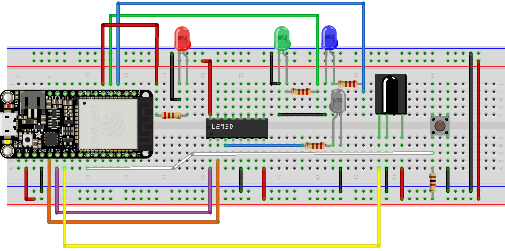
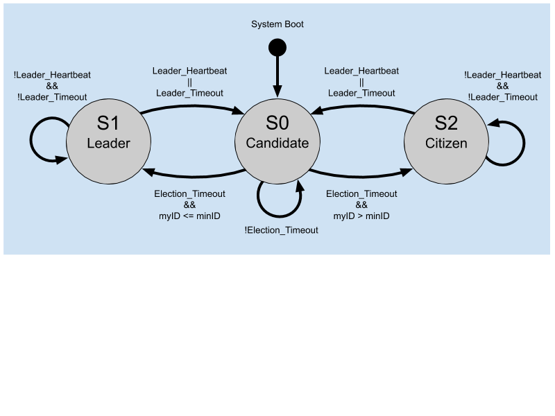
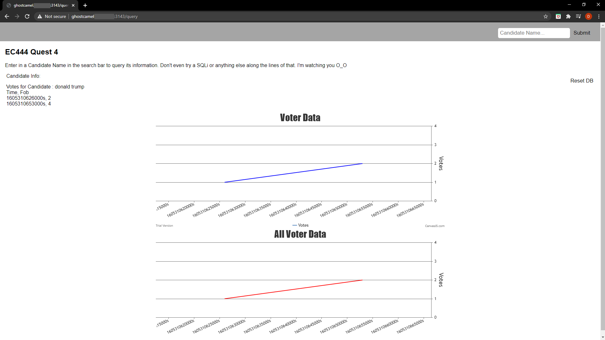
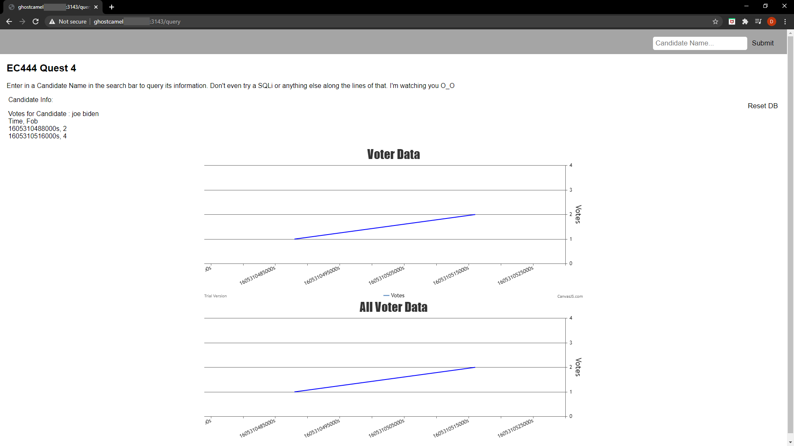
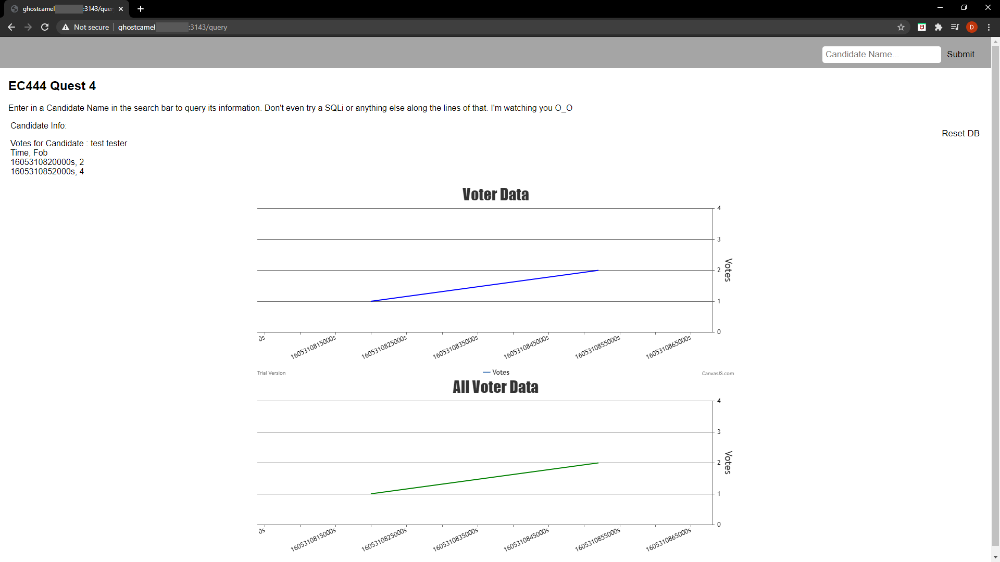

# Quest 4: Electronic Voting
Authors: Jonathan Cameron, DJ Morel, Ryan Sullivan

Date: 2020-11-13
-----

## Summary
In this quest, we designed and implemented a voting system using a Raspberry 
Pi Zero as a database and ESP32s as a means to cast votes to the database. 
The votes cast for each candidate are displayed on a web portal using 
CanvasJS. This web portal can be accessed remotely from outside its local 
access point using port forwarding.  

Votes are cast by first sending a UART signal to another fob, using an IR 
transmitter (LED) and receiver, and then forwarding this vote data to the poll 
leader, which in turn sends the vote to the Pi server. The Pi server then 
stores this data. It also keeps track of who has voted so that no fob can cast 
its vote twice.  


## Self-Assessment

### Objective Criteria

| Objective Criterion | Rating | Max Value  | 
|---------------------------------------------|:-----------:|:---------:|
| Fob performs IR NFC data exchange of vote to another fob (LED indication) | 1 |  1     | 
| Receiving fob communicates vote to Poll Leader (LED indication) via network communication | 1 |  1     | 
| Poll Leader (LED indication) is replaced if fails | 1 |  1     | 
| Poll Leader reports votes to server database | 1 |  1     | 
| Portal allows query to database to show actual vote counts per candidate | 1 |  1     | 
| Operates over multiple sites or with all available fobs (up to 9) | 1 |  1     | 
| Investigative question response | 1 |  1     | 


### Qualitative Criteria

| Qualitative Criterion | Rating | Max Value  | 
|---------------------------------------------|:-----------:|:---------:|
| Quality of solution | 5 |  5     | 
| Quality of report.md including use of graphics | 3 |  3     | 
| Quality of code reporting | 3 |  3     | 
| Quality of video presentation | 3 |  3     | 


## Solution Design
Our system uses multiple pins to connect the ESP with all of its sensors. The 
exact pins used are listed below (as labeled on the Huzzah32 board):  
* 3V --> 3.3 V input to the L293D (+V and +Vmotor), IR receiver (VCC), candidate selector button, and vote transmission button.
* GND --> Ground to the L293D (0V), IR LED, IR receiver, candidate selector button, vote transmission button, and RBG LEDs.
* A0 --> RMT output to the L293D (In 1).
* A1 --> TX output to the L293D (Enable 1).
* A2 --> RX input from the IR LED.
* A5 --> Input signal from the candidate selector button.
* 21 --> Input signal from the vote transmission button.
* 33 --> Output signal to the red LED.
* 32 --> Output signal to the green LED.
* 14 --> Output signal to the blue LED.

Since the system involves UDP communication, it is necessary to configure the 
device IDs and wireless access point (WAP) for each device. In order to do so, 
one must first manually update the `fobTable` in main.c to set the private IP 
addresses (`ip` field) and port numbers (`port` field) for each fob according to 
its local network. Then one needs to configure their router to enable port 
forwarding to these fobs and include the fobs' public IP address (router IP in 
the `ip_pub` field) and the public port number (`port_pub` field) used for port 
forwarding. Once the `fobTable` is updated and saved, one must then flash every 
fob after calling menuconfig to include the WAP credentials and device ID. Note 
that the device ID for the fob is equal to the index of the fob's information in 
the `fobTable` plus 1.  
```bash
$ idf.py menuconfig
# Under "Example Configuration" update the values for:
# 1. WiFi SSID
# 2. WiFi Password
# 3. Device ID (fob's index in the fobTable + 1)
$ idf.py build
$ idf.py -p PORT flash
```

It should be noted that this Quest uses quite a few node packages. You can 
install them by running the following NPM commands:  
```bash
$ npm install axios
$ npm install mongoose
$ npm install dgram
$ npm install mongodb
$ npm install express
$ npm install line-reader
$ npm install path
```


### Voting
To cast a vote, the user of a fob must use the candidate selector button (Pin A5) to select their desired candidate (R, G, B). The selection can be cycled through with wrap-around, so that the voter can keep go back to a different candidate if they miss click. The candidates are stored in an enum, `candidate_e`. 

Once the candidate has been chosen, the user can send the vote over UART to another fob using the vote transmission button (Pin 21), which sends a burst of UART data through the IR LED to the receiver fob. The receiver fob then forwards the vote.

Once the vote has been registered with the Pi, the Pi sends an ACK to the fob that cast the vote so it indicates its vote has been received and turns its LEDs off.

### Sending a vote to the poll leader
When a fob receives a vote over UART from the IR receiver, it stores the data in a buffer `ir_data`, where the first byte indicates a vote `V`, the second and third byte indicate the voter ID and their candidate and the fourth byte is a null character. Indicating the first character as a `V` means that the UDP server that receives it knows it is destined for the Pi server.

Once the `ir_data` buffer has been set up, the fob must determine if it is a leader or a follower. If it is a follower, it will send the vote onwards to the poll leader, if it is the leader it will send the vote on to the Pi. 

It should be noted that the fob sending vote data to the leader will continue to send the data until it receives an ACK from the leader. This prevents the loss of votes.

### Sending a vote to the Pi server.
Once the fob leader has received its vote, it will then send a message, over UDP, to our server, running on our RaspberryPi. The message contains a start vote 'V' byte, the fob_id and the candidate color that the fob voted for : ('R', 'G', 'B'). The server first checks to make sure a 'V' byte is present and that the message length contains the appropriate bytes, and parses the message data for validation. Then the server performs a check with the MongoDB database, running on the MongoDB Atlas service, querying as to whether the current fob_id is present in the database. If the fob_id is found, the vote is not counted and an acknowledgement byte, 'A', is sent back to the fob leader. Though, if the fob_id is not found in the query, the server creates a new entry with the fob_id, the name of the candidate the vote was cast for, and the time of registry. Afterwards, the server responds with a vote registered byte, 'R' and the fob_id under which the vote was registered.

### Storing the data
The data is stored using a Mongo DB. 

## Investigative Question
**List 5 different ways that you can hack the system (including influencing the 
vote outcome or preventing votes via denial of service). For each way, explain 
how you would mitigate these issues in your system.**  

### Denial of Servive (DoS)
A denial of service attack could be carried out by anyone who knew the IP address of the RPi and the port it is listening to, by sending a huge volume of "garbage" data to said port. DoS attacks are hard to defend against, especially if the attacker is using a botnet with several different IP addresses. To reduce the effect of a DoS attack, the fobs could have a list of several RPis that they could send votes to, and these RPis report to a central database which stores the votes.

### Influencing the vote outcome
Influencing the vote outcome could be achieved by sending valid voter information to the Pi port, by masquerading as the poll leader. This could be done really well if the attacker used their botnet to send enough valid votes to be registered but not so many that the system was DoS'd. To prevent this being done, the Pi could have a list of IDs of valid voter ESPs. Of course, the botnet could randomly chose the ID they send through with each vote, and some of these could match, but it could minimise the number of fraudulent votes. A better way to prevent these attacks would be to have an ID and associated ESP IP address sent with each vote, to check the ballots legitimacy. 

Another way the outcome could be influenced would be to send votes over the UART, much in the same way the Pi would not know where this vote had come from. Again this could be solved by sending an ID and ESP IP address (that is registered with the Pi) over UART along with the vote. A potential problem with this could be the packets become cumbersome and increase the chance of data/packet loss. Data/packet loss is why it is important to implement ACK signals similar to the implementation in our project.

### Man in the Middle (MitM) attack
It is not unreasonable to consider a MitM attack on the system. For example, if the fobs were being used in a public place, an attacker could pretend to be the Wireless Access Point (WAP) the ESPs depend on (this requires knowing the WAPs SSID and passphrase to ensure the fobs connect to it). As a MitM, the attacker could either prevent votes for certain candidates being forwarded on to the database or doctor the votes for another candidate. Remember, votes are sent with a `V` prefixing the fob ID and candidate to the database, so detecting these packets over the network wouldn't be too hard. Another thing to recall is the `checkCheckSum()` function is only used on the UART/IR data transmission between fobs, not between UDP, which is where the MitM attacks. Sending the checksum onwards with UDP would make things more difficult for an attacker to doctor a vote.

Mitigating MitM attacks is hard because the victim doesn't know their connection is being monitored; they still send and receive the data they normally would with an untampered connection. To warn a fob that their vote was being doctored by an MitM, the Pi server could return the candidate that was voted for in the ACK message. Of course in an election when one only gets to cast a singular vote, this is no good for the single user, but perhaps the fob could recognise that the ACK candidate does not match the sent candidate and send a warning message to the entire system to stop the election. Since votes are prefixed with `V`, the attacker can easily pick out voting data travelling through the pipe to the WAP. To make it harder to pick out this data, it could be encrypted before it is sent over UART and unencrypted at the Pi server.

### Hijacking the Poll Leader Position  
One of the design decisions we made was to have the poll leader send a 
heartbeat to each fob so that it told fobs in the system it was still alive 
for vote submissions and for syncing `count_leader` counters. By default, fobs 
begin in the candidate state upon boot, but will immediately switch to the 
citizen state if they receive a leader heartbeat. Our implementation does not 
check if the leader heartbeat comes from an authorized list. This means that a 
device outside of the offical `fobTable` could enter a fob poll leader 
election, and send a leader heartbeat to all of the fobs. Since each fob would 
drop out of the election upon receiving the heartbeat, only the malicious device 
would remain and become established as the offical poll leader without needing 
to worry about its relative device ID.  

Additionally, recall that all citizen fobs sync their `count_leader` count to 
the poll leader's heartbeat. This means that a malicious poll leader could send 
the came `count_leader` value instead of incrementing it every second. Doing so 
means that none of the fob citizens' `count_leader` counters increment and the 
malicious poll leader can keep its position indefinitely.  

In order to mitigate this attack, we can have each fob check the source of the 
leader's heartbeat prior to accepting it. This would help prevent fobs from 
prematurely leaving from the candidate state to the citizen state. It would 
also help prevent an adversary from forcing fob citizens to sync their 
`count_leader` variables to that of the tyrannical attacker.  


### Attacking the database
MongoDB can come with some security issues if not administrated properly. To start, MongoDB defaults to no password credentials which obviously presents a huge vulnerability when the DB is opened up to the whole internet. Secondly, any user that has read-only access to the DB, has read-only access to the _whole_ DB, which if the DB was used to store sensitive information like credit card details could be catastrophic. There is no transport encryption between a client and a node, so if a user is making a request to the DB, it comes back as plain-text, making it vulnerable to Address Resolution Protocol (ARP) spoofing/MitM attacks. Again, querying credit card details (as an example) in plain text is only good for attackers. There is also data encryption when the data is "at rest". 


## Sketches and Photos
**Figure 1**: Circuit Diagram (same as Skill 25, but duplicated button at pin 21)  
  

**Figure 2**: Poll Leader Election FSM  
  

**Figure 3**: 2 Fobs Vote for Red Candidate (Donald Trump) Web Search Query  
  

**Figure 4**: 2 Fobs Vote for Blue Candidate (Joe Biden) Web Search Query  
  

**Figure 5**: 2 Fobs VOte for Green Candidate (Test Tester) Web Search Query  
  


## YouTube Video Demos  
Due to the large amount of parts involved with this quest, we split up the 
video demos into multiple parts based on category. We recommend watching the 
demos in the following order:  

**Video 1**: Electronic Voting Overview  
[](https://youtu.be/opF991-4-Uo "Electronic Voting Overview - Click to Watch!")

**Video 2**: Electronic Voting Demo  
[](https://youtu.be/aEkPtsCPZZA "Electronic Voting Demo - Click to Watch!")

**Video 3**: Poll Leader Election Demo (Different Local Network Test)  
[](https://youtu.be/lGiXeqPFMfs "Poll Leader Election Demo - Click to Watch!")

**Video 4**: Poll Leader Election Algorithm Demo (Skill 28)  
[](https://youtu.be/04d_v9uRw24 "Leader Election Demo - Click to Watch!")  


## Supporting Artifacts
- [GitHub repo for our solution](https://github.com/BU-EC444/Team16-Cameron-Morel-Sullivan/tree/master/quest-4)  


## References (modules, tools, and sources used with attribution)  
* [W3Schools Node.js Tutorial](https://www.w3schools.com/nodejs/default.asp)  
* [W3Schools MongoDB Tutorial](https://www.w3schools.com/nodejs/nodejs_mongodb.asp)  
* [W3Schools Example Search Bar](https://www.w3schools.com/howto/howto_css_searchbar.asp)  
* [Express Documentation](https://expressjs.com/)
* [esp-idf udp_client example project](https://github.com/espressif/esp-idf/tree/master/examples/protocols/sockets/udp_client)  
* [esp-idf udp_server example project](https://github.com/espressif/esp-idf/tree/master/examples/protocols/sockets/udp_server)  
* [Setting a UDP Socket Timeout](https://stackoverflow.com/questions/13547721/udp-socket-set-timeout)
* [MongoDB Security Weaknesses](https://www.trustwave.com/en-us/resources/blogs/spiderlabs-blog/mongodb-security-weaknesses-in-a-typical-nosql-database/)  
* [Securing MongoDB](https://www.percona.com/blog/2020/08/10/securing-mongodb-top-five-security-concerns/)  

-----


