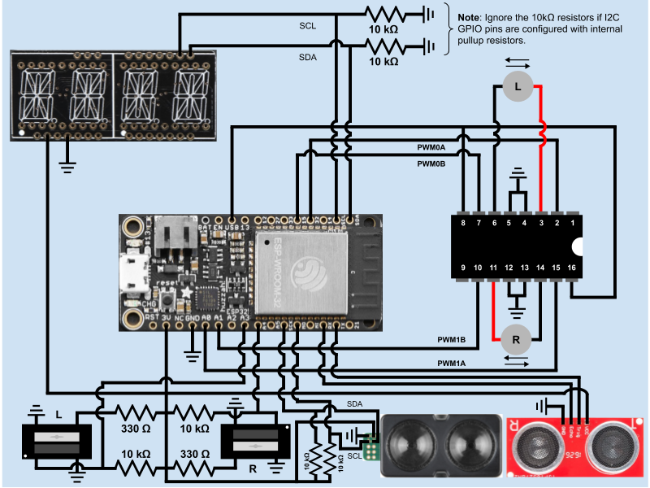

# Quest 5: Cruise Control
Authors: Jonathan Cameron, DJ Morel, Ryan Sullivan

Date: 2020-11-29
-----

## Summary

In this quest, we designed and implemented a platform for an autonomous car
that uses cruise control. By cruise control we mean the car can maintain a
constant velocity, avoid collision, and be turned on and off. This required
using LED/photo-sensor pairs to measure the car's velocity, a LIDAR for
measuring the distance to the guard-rail on the side of the road, and an
ultrasonic sensor to measure the distance from any obstructions in front and
stop accordingly. The car was also designed with a web-accessible start/stop
button, so it can be started and stopped remotely.

The specification required that the car maintain a course on the centre of the
road by +/- 25cm either way and this was achieved by using a LIDAR to measure
the distance from the side of the track and was interfaced through I2C.

Speed is regulated through PID control to hold a fixed speed setpoint, and
must be within the range of 0.1-0.4m/s. The speed must be displayed on an
alpha-numeric display, also interfaced through I2C. PID control was implemented
in software, with the help of two LED/photosensor pairs. These sensors were
sampled with ADC to measure pulses in voltage which were used to calculate
the rpm of the wheel, and therefore the speed of the wheel and car.

Finally the car must be able to stop within 20cm of the end of the track,
with start and stop instructions being able to be delivered remotely. The
car stops itself when it comes to an obstacle or the end of the track by
using an ultrasonic sensor.

## Self-Assessment

### Objective Criteria

| Objective Criterion | Rating | Max Value  | 
|---------------------------------------------|:-----------:|:---------:|
| Controls steering to maintain center of course +/- 25cm for entire length | 1 |  1     | 
| Uses PID for speed control holding a fixed speed setpoint after startup and before slowdown [0.1-0.4m/s] | 1 |  1     | 
| Stops within 20cm of end without collision | 1 |  1     | 
| Start and stop instructions issued wirelessly from phone, laptop, or ESP | 1 |  1     | 
| Measures wheel speed or distance | 1 |  1     | 
| Uses alpha display to show current distance or speed | 1 |  1     | 
| Successfully traverses A-B in one go, no hits or nudges | 1 |  1     | 

### Qualitative Criteria

| Qualitative Criterion | Rating | Max Value  | 
|---------------------------------------------|:-----------:|:---------:|
| Quality of solution | 5 |  5     | 
| Quality of report.md including use of graphics | 3 |  3     | 
| Quality of code reporting | 3 |  3     | 
| Quality of video presentation | 3 |  3     | 

## Solution Design
Our system uses multiple pins to connect the ESP with all of its sensors. The 
exact pins used are listed below (as labeled on the Huzzah32 board):  
* 3V --> 3.3 V input to the I2C display, optical decoder anodes, LIDAR, and ultrasonic sensor.  
* GND --> Ground to various sensors.  
* USB --> 5 V input to the L293D (+V and +Vmotor).  
* A0 --> PWM signal output (PWM1A) to L293D pin 15 (4A) for controlling the right motor along its black wire.  
* A1 --> PWM signal output (PWM1B) to L293D pin 10 (3A) for controlling the right motor along its red wire.  
* A3 --> ADC input signal from the left optical decoder's collector (1) pin.  
* A4 --> ADC input signal from the right optical decoder's collector (1) pin.  
* SCK --> SDA connection to the LIDAR sensor.  
* MO --> SCL connection to the LIDAR sensor.  
* RX --> RX input from the ultrasonic sensor's Echo pin.  
* TX --> TX output to the ultrasonic sensor's Trigger pin.  
* 15 --> PWM signal output (PWM0B) to L293D pin 7 (2A) for controlling the left motor along its black wire.  
* 32 --> PWM signal output (PWM0A) to L293D pin 2 (1A) for controlling the left motor along its red wire.  
* SCL --> SCL connection to the I2C display.  
* SDA --> SDA connection to the I2C display.  

### UDP Server
To send a start/stop command to the car, a node.js server was designed to
serve a webpage on localhost:8080 with a button that sends an `!` byte.
We took inspiration from our voting system for communicating with our ESP
through UDP. When the ESP UDP server receives the `!`, the server invertes
the state of `remoteStop`, which the car needs to be false to operate.
While `remoteStop` is true the UDP waits for a `!` byte to invert
`remoteStop` and start operating again. By default the car starts with
`remoteStop` as false so it starts moving immediately.
### Ultrasonic Sensor
The car checks for obstacles or the end of the track with an ultrasonic
sensor which is accessed through GPIO. If there is a obstruction blocking
the car, the `blocked` flag is raised and the car is stopped.
### LIDAR
The distance from the side of the road is measured using the Garmin
LIDARLite v4, which is controlled using I2C protocol. This is one of two
I2C devices used in this design.
### MCPWM
Once these measurements and checks have been made the wheels are spooled up
using MCPWM. The `cruise_control` task passes the required duty cycle to the
motors, after checking the duty cycle is below 100%. Passing different duty
cycles to the left and right motors is how the car maintains a straight line
along its course, with the help of the measurements that the the LIDAR makes.
### PID
Through PID, which is implemented in software, the car is kept on a straight
path along the track, and any changes in distance from the wall are used to
calculate the correction required to stay straight.
### LED/Photo-sensor pair
To calculate the speed of the car, a rotating plate with spokes cut into it
was placed on each axle. Then, a LED/photo-sensor pair for each axle was
directed at the rotating plate. Since the spokes of the plate are more
reflective than the gaps of the wheel, there is a higher voltage measured
when the LED light is reflected back to the photo-sensor. This difference in
voltage is sampled using ADC and so pulses of voltage can be measured and
counted. The ADC is sampled every 15mS so that no ticks are missed and the
speed is as accurate as possible. By counting the number of pulses, or ticks,
the speed is calculated using `ticks / total_ticks * circumference / sample_time`.
### Alpha-Numeric
The second I2C device in our design was the alpha-numeric display which was
used to display the speed of the car, as calculated by the LED/photo-sensor
pair.

## Investigative Question
**How would you change your solution if you were asked to provide 'adapted' cruise control?**
-Better forward sensor
To move the design solution forwards to adaptive cruise control, a more
accurate, reliable forward sensor would be used. The ultrasonic is good
enough to tell when there is an obstruction and bring the car to a stop but
could not be relied upon to maintain a safe distance from the car infront.
Of the sensors we have, the LIDAR would be the most accurate, however using
another LIDAR would dramatically increase the cost of the car as a whole.
However, the design would not do-away with the ultrasonic, because it would
make a good fail-safe backup sensor. As discussed in a previous quest,
Tactile Internet, sun make sensor bad. Light from the sun interferes with
near-IR sensors such as the Garmin LIDAR-Lite v4 LED and so to ensure the car
doesn't rear-end the car in front, keeping the ultrasonic would be good for
safety.

With a more accurate sensor, the car could use PID control to match the speed
of the car in front.

For our design we could implement a way to adjust the speed of the car when
not following another car, so that the journey could be completed quicker.
This could be done through the webpage on localhost:8080.

Finally, to make the journey safer, two cars could communicate with each other
in the same way they communicated in the Electronic Voting quest. If two cars
knew of each other beforehand be being part of a larger network of cars, or
could alert each other of their presence en route, they could set up a UDP
connection and talk to each other. From there, they could maintain a safe
distance by knowing each others GPS coordinates, or even better and perhaps
more reliably, they could tell each other what manuever they were about to carry
out. This would be fantastic for the following car because then it would be
told when the leader was slowing down before the deceleration and could start
to slow in anticipation. This could have real-world implications where a train
of cars could follow each other closely and know when to slow down and speed up
to increase fuel efficiency.

## Sketches and Photos
**Figure 1**: Circuit Diagram  
  

## YouTube Video Demo

## Supporting Artifacts
* [GitHub repo for our solution](https://github.com/BU-EC444/Team16-Cameron-Morel-Sullivan/tree/master/quest-5)  

## References (modules, tools, and sources used with attribution)
* [Espressif ADC1 example project](https://github.com/espressif/esp-idf/tree/master/examples/peripherals/adc)  
* [esp-idf-lib ultrasonic component](https://github.com/UncleRus/esp-idf-lib/tree/master/components/ultrasonic)  
* [Espressif MCPWM Brushed DC Motor Control example project](https://github.com/espressif/esp-idf/tree/master/examples/peripherals/mcpwm/mcpwm_brushed_dc_control)  
* [Sparkfun Optical Decoder Sensor Guide](https://learn.sparkfun.com/tutorials/qrd1114-optical-detector-hookup-guide)  
* [Garmin LIDAR v4 Specs](http://static.garmin.com/pumac/LIDAR-Lite%20LED%20v4%20Instructions_EN-US.pdf)  

-----

