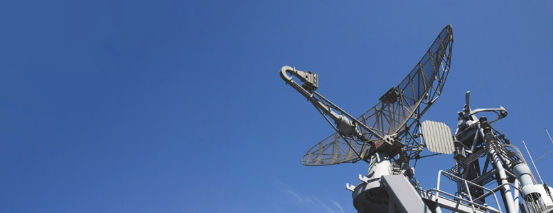

# Quest 6 - LIDAR Radar
Your goal in this quest is to create a robust radar system capable of 
detecting distances 180 degrees in the x and y plane. All of your data 
should be graphed and displayed on a Node.js server for a client to access.  

**Figure 1**: Example Radar Configuration  
  

## Description
The overall approach involves (a) attaching the necessary sensors and actuators 
to your ESP, (b) configuring your Raspberry Pi to use its camera module and set 
up a Node.js server, and (c) determining how to display the results of the 
LIDAR radar graphically.  

We want to make the system distributed. To do so, each local radar system is to 
have 2 ESPs. One ESP acts as the "dish" where it uses the servo to rotate the 
LIDAR and collects the desired data. The dish should be connected to the Raspberry 
Pi and send data over UART. The second ESP acts as the "remote controller" (RC) where 
a user can press a button to activate/disable the dish ESP at the press of a button. 
The RC ESP should have a LED to indicate the current status of the dish ESP (rotating 
or not). This LED is very important because the dish ESP may be toggled by your web 
interface and instead of the controller. Users should be aware of what will happen if 
they press the button.  

The radar system should be stationary (because radars don't have legs) so we 
suggest you to use the purple car as a frame. Building the radar system may be 
difficult due to all of the moving parts. Make sure to be careful with the wires 
so that nothing gets tangled as the system rotates. Figure it out.  

## Solution Requirements
* Must build 2 ESPs per system: one that acts as a dish (rotates LIDAR & collects data) and one that activates the dish.
* Actuator 1 (Dish ESP): Must use a servo to rotate the radar 180 degrees.  
* Actuator 2 (Dish ESP): Must use the alphanumeric I2C display to show the current radar distance.  
* Actuator 3 (RC ESP): Must use a green (can ONLY be green) LED to indicate the status of the dish ESP (ON for active, OFF for disabled).  
* Actuator 4 (RC ESP): Must use a yellow LED to indicate processing commands to the dish ESP.  
* Sensor 1 (Dish ESP): Must use the LIDAR sensor to get object distances as it rotates.  
* Sensor 2 (Dish ESP): Must use the accelerometor to measure the angles (roll & pitch) of the radar (use it for graphing).  
* Sensor 3 (Dish ESP): Must use a thermistor to measure the temperature of the environment (very important to see if the environment is a nuclear wasteland).  
* Sensor 4 (RC ESP): Must use a button to toggle the dish ESP's radar behavior (sends UDP messages).  
* Must use timer interrupts in the system (handling LED changes for the RC ESP).  
* Must send radar data to the Raspberry pi over UART.  
* Must use the Raspberry pi to set up a Node.js server and present sensor data.  
* Must use the Raspberry pi camera module to present "human vision" of the environment, and livestream the feed on your web page.  
* Must enable radar control in your web interface (buttons to turn on and off the dish ESP).  

## Rubric
* [Assessment Rubric](http://whizzer.bu.edu/rubrics/quest-6-rubric.pdf)

## Assignment
1. Design and build your solution to meet the criteria specified in this quest and the rubric.  
2. Demonstrate your work.  
3. Report as per quest reporting instructions.  
4. Investigative question: None.  

## Reference Material
* [Radar](https://en.wikipedia.org/wiki/Radar)  

