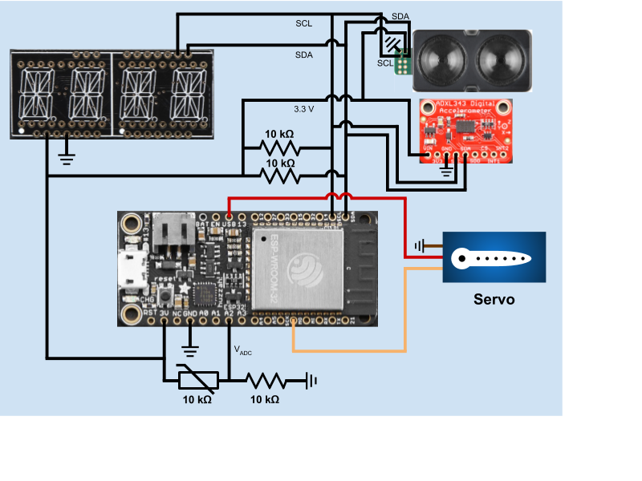
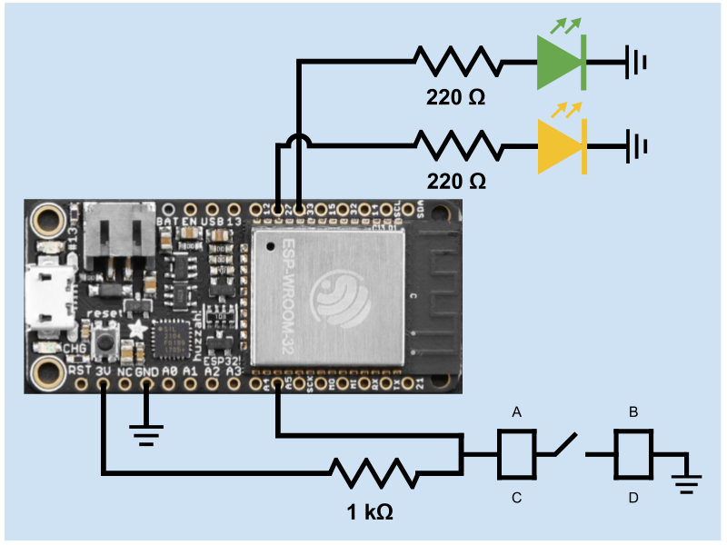
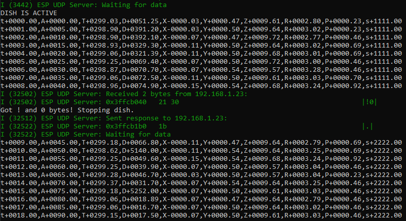
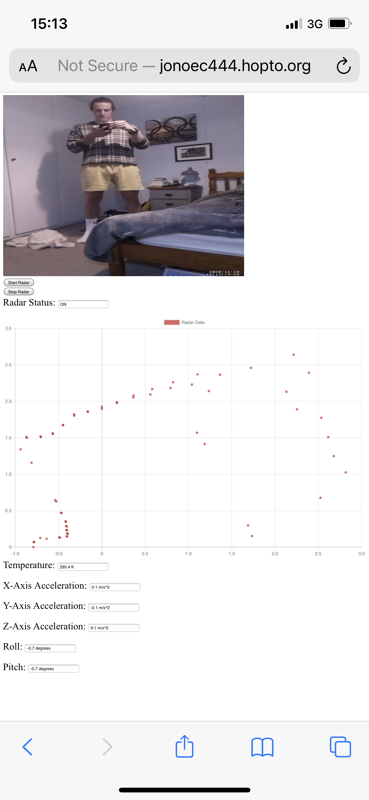

# Quest 6: LIDAR Radar  
Authors: Jonathan Cameron, DJ Morel, Ryan Sullivan  

Date: 2020-12-09
-----

## Summary
For our free-form project, we implemented a LiDAR radar, using the Garmin LiDAR, two connected ESPs and a Raspberry Pi with the camera module attached. The first ESP acts as a remote control for the second ESP, which acts as a radar dish (referred to as the 'dish' or 'LiDAR'). The RC sends instructions over UDP to the dish and has two status LEDs, a green one to indicate whether the dish is active or not, and a yellow LED to indicate whether the RC has any pending instructions. Both of these LEDs respond to ACKs sent back by the LiDAR. Movement of the dish is made possible by mounting it to a servo. This provides us with an angle and radius to calculate x,y positions of structures in the environment around the dish. Acceleration, pitch, roll, temperature and LiDAR status is all sent to the Raspberry Pi over the UART serialport connection they share. This the dish is powered by the RPi. A camera module is also connected to the RPi and mounted to the LiDAR to provide video feed of what the LiDAR is measuring. The RPi is then responsible for posting all of this sensor data, including the video, to a singular webpage, which also has an embedded start/stop button for the dish and a current status indicator of its activity. Please note that this webpage is accessible through port-forwarding, so the dish can be started/stopped and viewed globally. Prof. Little had the honour of starting it in our in class demo :)

## Self-Assessment

### Objective Criteria

| Objective Criterion | Rating | Max Value  | 
|---------------------------------------------|:-----------:|:---------:|
| Achieves specified function | 1 |  1     | 
| At least 2 functional actuators | 1 |  1     | 
| At least 3 functional sensors | 1 |  1     | 
| At least 1 camera | 1 |  1     | 
| Demonstrates remote control and data presentation on separate network | 1 |  1     | 
| Has a time based function | 1 |  1     | 
| Multiple participating distributed ESP32s | 1 |  1     | 

### Qualitative Criteria

| Qualitative Criterion | Rating | Max Value  | 
|---------------------------------------------|:-----------:|:---------:|
| Quality of solution | 5 |  5     | 
| Quality of report.md including use of graphics | 5 |  3     | 
| Quality of code reporting | 3 |  3     | 
| Quality of video presentation | 3 |  3     | 

## Solution Design
Our system uses multiple pins to connect the ESP with all of its sensors. The 
exact pins used for the dish ESP are listed below (as labeled on the Huzzah32 
board):  
* 3V --> 3.3 V input to the accelerometer, LIDAR, and I2C display.  
* GND --> Ground to various sensors.  
* USB --> 5 V input to the servo.  
* A2 --> ADC input signal from the thermistor.  
* MO --> PWM output signal to the servo.  
* SCL --> SCL connection to the accelerometer, LIDAR, and I2C display.  
* SDA --> SDA connection to the accelerometer, LIDAR, and I2C display.  

The exact pins used for the RC ESP are listed below (as labeled on the Huzzah32 
board):  
* 3V --> 3.3 V input for the push button's pull-up resistor.  
* GND --> Ground for the button and LEDs.  
* A5 --> Input from the button for hardware interrupts.  
* 27 --> Output to control the yellow LED.  
* 33 --> Output to control the green LED.  

### I2C Bus
The three I2C devices our project uses all run on a single I2C bus, using the 3V, GND, SCL and SDA. This can be achieved because the I2C bus is 8-bit addressable, so one device is addressed and the others are blocked until that one device has stopped being addressed by its master.
* LiDAR
The LiDAR is a main component of the project because it is the only way we measure distance. Plus it does a much better job at it than the IR and ultrasonic range finders.  
* ADXL343 Accelerometer
The Accelerometer is included so that it's possible to gauge the environment the LiDAR is currently operating in. This can be extended to use the accelerometer roll and pitch values to make adjusted distance calculations for when the system is mounted on an uneven surface.  
* Alpha-Numeric display
The Alpha-Numeric display shows the value measured by the LiDAR each time it is read from. The value is read out in centimetres, the unit the LiDAR operates in.

### Servo
The servo, powered by PWM, is key for giving angle to the LiDAR measurements, and rotates by 5 degrees each movement. This allows the LiDAR to map points in the x,y plane using the radius R from the Garmin LiDAR and the angle from the servo.

### Thermistor
The thermistor is read through ADC on the ESP32 and gives further information about the environment around the kit. Creative uses for this project do include monitoring a nuclear wasteland or extremely cold environments. Both require proper tools to map out the environment.  

### Button
The button is used as a hardware interrupt for the ESP. Upon pressing the button, a signal is send to the dish ESP with an instruction to either start or stop the dish, based on its current state.

### LEDs
Two LEDs were used in the solution. One reflected the state of the dish, green LED on if the dish is on, no green LED if the dish is inactive. A yellow LED reflected whether on not there is a pending instruction for the dish to act on. 

### Raspberry Pi
The Raspberry Pi was used as the power source for the dish ESP, and it also read the ESP UART output to produce a webpage with the data included in this UART signal. This webapage is where the map measured by the LiDAR is displayed. Also on the webpage is the other sensor data (accelerometer data, temperature), a start and stop button for the LiDAR dish, and the current status of the dish. A camera feed can also be found on this webpage, and the camera is mounted to the LiDAR/servo and provides a feed of what the device is measuring at the time.

### UDP
UDP was used for the remote control, so that the dish can be started and stopped remotely. An instruction is sent, and the dish works out whether it is to start/stop depending on its current state. It then sends an ACK back to the RC. The RC lights its yellow LED to indicate the instruction is pending. The dish then later sends an ACK to say the instruction has been followed, upon which the yellow LED goes out.

### UART
UART was used to read the measurement data outputted by the dish ESP. The Pi reads this data and posts it to the webpage. See **Figure 3** for an example of the UART message format.  

### node.js
The UART data was handled by a node.js program, and the graphical representation of the data was produced with the GraphJS library.  

## Sketches and Photos
**Figure 1**: Dish ESP Circuit Diagram  
  

**Figure 2**: Remote Controller (RC) ESP Circuit Diagram  
  

**Figure 3**: Sample of the Dish ESP UART Message Format  
  

**Figure 4**: Mobile Version of the Web Interface using Cellular (External) Network  
  

## YouTube Video Demo  

## Supporting Artifacts
* [LIDAR Radar Quest Description](https://github.com/BU-EC444/Team16-Cameron-Morel-Sullivan/blob/master/quest-6/Quest6-LIDAR_Radar.md)  
* [GitHub repo for our solution](https://github.com/BU-EC444/Team16-Cameron-Morel-Sullivan/tree/master/quest-6)

## References (modules, tools, and sources used with attribution) 
* [Portal](https://en.wikipedia.org/wiki/Portal_(series))  
* [Espressif ADC1 example project](https://github.com/espressif/esp-idf/tree/master/examples/peripherals/adc)  
* [EC444 accelerometer in i2c-accel example](https://github.com/BU-EC444/code-examples/tree/master/i2c-accel)  
* [EC444 button & timer handling in traffic-light-ir-example](https://github.com/BU-EC444/code-examples/tree/master/traffic-light-ir-example)  
* [Garmin LIDAR v4 Specs](http://static.garmin.com/pumac/LIDAR-Lite%20LED%20v4%20Instructions_EN-US.pdf)  
* [EC444 alphanumeric display in i2c-display example](https://github.com/BU-EC444/code-examples/tree/master/i2c-display)  
* [Espressif UDP client example project](https://github.com/espressif/esp-idf/tree/master/examples/protocols/sockets/udp_client)  
* [Espressif UDP server example project](https://github.com/espressif/esp-idf/tree/master/examples/protocols/sockets/udp_server)  
* [Espressif WiFi station example project](https://github.com/espressif/esp-idf/tree/master/examples/wifi/getting_started/station)  

-----

